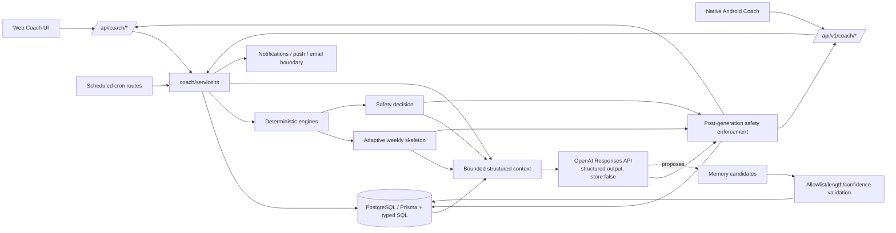
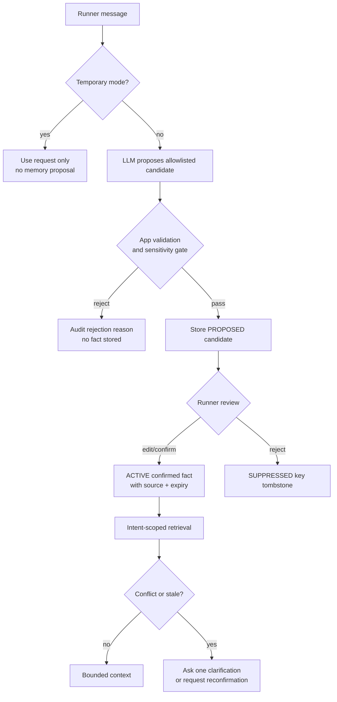
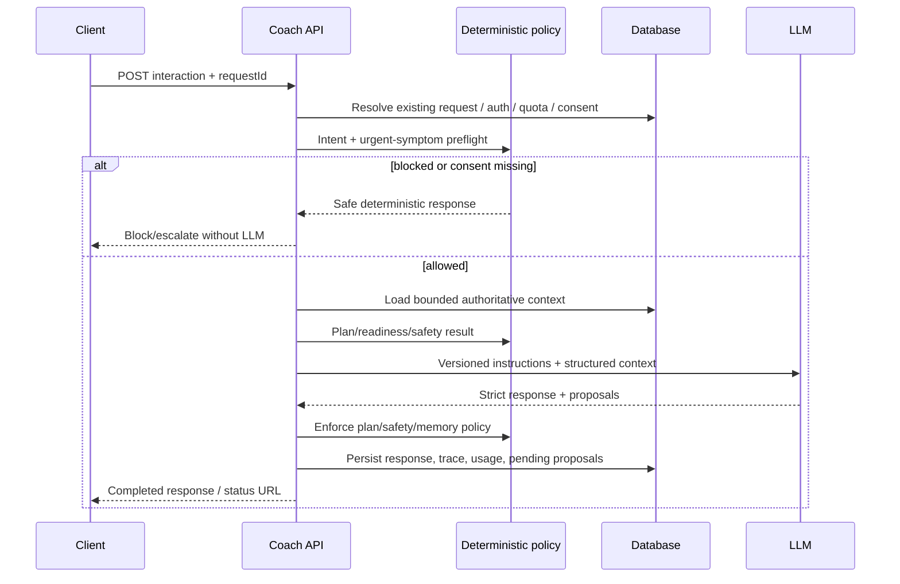

# ZidRun AI Running Coach — Repository Review

**Review date:** 2026-08-02  
**Repository revision reviewed:** `abee6f1`  
**Review type:** repository-level product, UX, architecture, AI, safety/privacy, mobile-parity, and test review  
**Evidence notation:** **Observed** means directly verified in repository code, documentation, tests, or approved screenshots. **Inferred** means a likely user or operational consequence that was not validated in a running production environment. **Recommended** means proposed future behavior.

## 1. Executive Summary

### Overall quality score: 6.2/10

ZidRun's Coach is substantially more than a generic chat wrapper. It already has a deterministic one-week planning engine, explicit safety enforcement after model generation, structured context and output schemas, bounded conversation history, runner-controlled memory inspection, usage accounting, subscriptions, reminders, post-run analysis, sleep and nutrition context, three locales, and both web and native Android clients. That is a strong technical base.

It is not yet credible for a broad production release. Two issues are release-blocking: urgent symptoms written in the current chat message do not enter the deterministic safety classifier, and the health-data consent checkbox is not persisted as an auditable grant even though health/body data is stored and sent to the AI provider. The current release plan already places the product on hold and explicitly blocks health-memory work pending security/privacy gates (`EXECUTION_PLAN.md`, `SEC-002`, `SEC-006`, and `SEC-007`).

| Dimension | Score | Assessment |
|---|---:|---|
| Product usefulness | 7.0 | Strong daily loop and broad feature coverage; key intelligence is not yet reflected in recommendations. |
| Training credibility | 5.5 | Safe deterministic progression exists, but target time, readiness, sleep, constraints, and several collected fields do not alter the plan. |
| UX and trust | 6.5 | Good approved flows and localized states; the conversation hides useful rationale and web/native plan behavior diverges. |
| AI architecture | 7.0 | Structured, bounded, and subordinate to deterministic rules; lacks idempotency, explicit intent/safety preflight, and robust evaluation. |
| Safety and privacy | 4.0 | Good foundations, but the chat-message safety bypass and unrecorded consent are P0 issues. |
| Reliability and operations | 6.0 | Rate limits, usage logs, timeouts, cron dedupe, and provider errors exist; synchronous generation, incomplete config documentation, and limited product telemetry remain. |
| Cross-platform parity | 5.5 | Native screens and v1 facades are real, but memory/voice and plan lifecycle parity are incomplete, with documented deployed-endpoint gaps. |

### Top five findings

1. **P0 — Chat-only urgent symptoms bypass the deterministic safety gate.** `createCoachInteraction()` evaluates a selected or recent run plus stored goal injury notes, but not `input.message` (`src/lib/coach/service.ts:1093-1104`). `evaluateCoachSafety()` only scans `run.symptoms` and `run.notes` (`src/lib/coach/safety.ts:34-45`). A runner can therefore type “I fainted and have chest pain” into chat while the interaction is classified `CLEAR` before the model call.
2. **P0 — Health-data consent is not auditable.** The onboarding checkbox is local React state and is initialized to true during editing (`src/components/coach/coach-goal-form.tsx:78-86`, `:461-488`). No consent version, purpose, timestamp, revocation, or provider-processing grant exists in `RunnerGoal`, `User`, or a dedicated consent model (`prisma/schema.prisma:536-575`).
3. **P1 — The training engine does not use much of the data the product collects.** The planner input has no target time, recent result, sleep, nutrition, constraints, health notes, HR/cadence, equipment, or session-time budget (`src/lib/coach/adaptive-planner.ts:28-44`). `targetDistanceKm` is passed but is not read when constructing the week. Target-time goals therefore do not deterministically change pace or feasibility.
4. **P1 — Memory controls can be undone by later extraction.** `writeMemories()` says dismissed facts must not be relearned, but it only supersedes `ACTIVE` rows and then unconditionally inserts a new `ACTIVE` row (`src/lib/coach/memory-store.ts:52-74`). Delete-all also removes every tombstone (`:184-187`), so the same fact can return. Existing memory tests cover pure validation/retrieval, not this database lifecycle.
5. **P1 — Plan lifecycle and client parity are inconsistent.** Editing a goal updates all planning and health inputs but leaves the current plan untouched (`src/lib/coach/service.ts:262-304`). Web goal creation requires an AI-generated draft and acceptance (`src/components/coach/coach-plan-panel.tsx:99-138`), while native goal creation immediately activates a deterministic plan (`src/app/api/v1/coach/goals/route.ts:95-117`). The native option plan also records production `404/405` gaps and missing native memory/voice parity (`docs/NATIVE_ANDROID_OPTION_PLAN.md`, Phase 8 evidence).

### Biggest items by category

- **Biggest UX issue:** the chat UI generates but does not render `recoveryAdvice`, `usedSignals`, `dataGaps`, or `followUpQuestion`; only summary/progress/positive/warning signals appear (`src/components/coach/coach-conversation.tsx:324-340`). The user cannot see why the coach answered as it did or supply the most valuable missing datum.
- **Biggest technical issue:** the deterministic plan is goal-type-aware but not target-performance- or readiness-aware. Many expensive-to-collect inputs currently affect prose only, not the schedule.
- **Biggest safety/privacy issue:** the current user message is outside deterministic symptom triage, and there is no durable consent record for health data processing.
- **Biggest opportunity:** turn Coach into a transparent adaptation loop—planned session → observed run/recovery → deterministic plan diff → runner approval → explanation—rather than making chat the center of gravity.

## 2. Scope and Files Reviewed

### Governing product, execution, and data documents

- `EXECUTION_PLAN.md` — release hold, security gates, native parity, Coach acceptance criteria.
- `PRODUCT.md` — stable product, theme, language, and platform decisions.
- `CODEX_CONTEXT.md` — architecture and raw-SQL context.
- `docs/COACH_CONTEXT_DATA_CONTRACT.md` — permitted context, bounds, and health-memory restriction.
- `docs/coach-design/COACH_DESIGN_FLOW.md` — approved Coach journey and acceptance rules.
- `docs/MOBILE_ANDROID.md` and `docs/NATIVE_ANDROID_OPTION_PLAN.md` — Capacitor/native structure, deployed API evidence, and parity status.
- `docs/TESTING.md` — unit, E2E, visual, emulator, device, and release procedures.
- `.agents/skills/zidrun-app-review/SKILL.md` — repository-specific review authority.

### Approved visual references inspected at original resolution

- `docs/coach-design/images/01-coach-overview-v2.png`
- `docs/coach-design/images/02-coach-goal-setup-v2.png`
- `docs/coach-design/images/03-weekly-plan-v2.png`
- `docs/coach-design/images/04-coach-conversation-v2.png`
- `docs/coach-design/images/05-sleep-recovery-v2.png`

The v2 screens are visually coherent: sporty but restrained, mobile-first, high-contrast, and focused on a clear next action. The review compares implementation structure to those references; it does not claim pixel parity from a live browser/emulator capture.

### Implementation areas reviewed

| Area | Representative evidence |
|---|---|
| Web pages and components | `src/app/account/coach/page.tsx`; `src/components/coach/coach-dashboard.tsx`, `coach-goal-form.tsx`, `coach-plan-panel.tsx`, `coach-conversation.tsx`, `coach-memory-panel.tsx`, run/sleep/nutrition/audio components |
| Web APIs | `src/app/api/coach/**` for goals, interactions, plans, workouts, runs, memory, sleep, nutrition, transcription, and TTS |
| Mobile API facade | `src/app/api/v1/coach/**`; `src/lib/api/v1/coach.ts` |
| Native Android | `native-android/feature/coach/**`; `native-android/core/network/.../ZidRunApi.kt`, `Dtos.kt`; `native-android/core/auth/.../Repositories.kt` |
| Orchestration/domain | `src/lib/coach/service.ts`, `context.ts`, `openai.ts`, `schemas.ts`, `entitlement.ts`, `topicality.ts` |
| Planning and feedback | `adaptive-planner.ts`, `planning.ts`, `metrics.ts`, `adherence.ts`, `workout-structure.ts`, `workout-match.ts` |
| Safety | `safety.ts`, run validity and incident paths, prompt restrictions |
| Context and memory | `context.ts`, `plan-context.ts`, `memory.ts`, `memory-store.ts`, `docs/COACH_CONTEXT_DATA_CONTRACT.md` |
| External context | `weather.ts`, `elevation.ts`, `nutrition.ts`, sleep parsing and run-route processing |
| Jobs and notifications | `src/lib/coach/reminders.ts`; `src/app/api/internal/cron/{plan-rollover,training-reminder,inactivity-nudge}` |
| Persistence | Coach-related Prisma models/enums and migrations from `20260621013000_runner_ai_coach` onward |
| Admin/operations | `src/app/admin/coach/page.tsx`, `src/lib/coach/report.ts`, subscription and usage code, `.env.example` |
| Tests | Coach/context/adaptive/memory/workout/mobile scripts; `tests/coach.e2e.spec.ts`; Coach history/memory visual specs; broader auth/run-validity coverage |
| TODO/config/flags | Repository searches for Coach TODO/FIXME, environment keys, model/provider switches, rate limits, and cron settings |

### Validation performed

The deterministic suites were run without application code changes:

- `scripts/test-coach.ts` — passed.
- `scripts/test-coach-context.ts` — passed.
- `scripts/test-adaptive-planner.ts` — 68/68 passed.
- `scripts/test-coach-memory.ts` — 36/36 passed.
- `scripts/test-workout-structure.ts` — passed.
- `scripts/test-coach-mobile.ts` — could not run its server/database contract matrix because `DATABASE_URL` is absent; cleanup failed before a usable environment was available.

The live OpenAI E2E, production deployment, browser visual capture, emulator, and physical-device flows were not executed. The optional `impeccable` visual-review skill referenced by the repository skill was not available in this session, so screenshot inspection used the repository-specific review skill and direct original-resolution inspection.

### Confidence and missing evidence

- **High confidence:** static control-flow, schema, persistence, safety-input, memory-state, planner-input, API-shape, and client-parity findings. These are directly observable and several are reinforced by passing pure tests.
- **Medium confidence:** the severity of UX friction, latency impact, reminder fatigue, and real-world training usefulness. The code strongly suggests the stated consequences, but no production analytics, runner interviews, or live session recordings were available.
- **Not established:** live provider answer quality, real p50/p95 latency and cost, production database behavior/volume, current deployed v1 behavior beyond the repository's dated probe evidence, browser pixel parity, native emulator/device accessibility, and legal sufficiency of consent/escalation copy.

## 3. Current Implementation

### Current architecture



### Current runner journey

1. **Entitlement:** a new account receives a default seven-day trial; subscribed and trial tiers have daily/monthly AI quotas (`src/lib/coach/entitlement.ts:18-28`, `:38-96`).
2. **Goal onboarding:** a five-step form collects goal, target, experience, volume history, availability, health/injury data, body data, locale, and a consent checkbox (`src/components/coach/coach-goal-form.tsx`). Data is validated through `createCoachGoalSchema` (`src/lib/coach/schemas.ts:18-82`) and stored in `RunnerGoal`.
3. **Initial plan:** on web, the runner explicitly requests an `INITIAL_PLAN`, waits for an AI response, reviews a deterministic workout skeleton wrapped in an AI summary, and accepts the draft. On native, goal creation best-effort calls `ensureCurrentWeekPlan()` and immediately creates an active rule-based week. This is observed behavior divergence.
4. **Daily use:** the overview combines goal, recent metrics, adherence, current/next workout, sleep, Coach entitlement, interactions, and tips (`src/lib/coach/service.ts:872-920`). The runner can log a run, skip or move a workout, log sleep, ask a question, or request post-run analysis.
5. **Run processing:** run input is validated, ownership and conservative workout matching are applied, GPS validity/elevation/weather are processed, the linked workout may be completed, and metrics/safety are refreshed (`src/lib/coach/service.ts:357-541`).
6. **Coach interaction:** topicality and entitlement are checked; recent runs, plan adherence, memory, goal, sleep, nutrition, race, weather, and conversation history are assembled; a deterministic weekly skeleton and safety decision are created; one structured AI response is generated; deterministic workout/safety values overwrite the model's schedule; the interaction and usage are persisted (`src/lib/coach/service.ts:1049-1295`).
7. **Memory:** up to three model-proposed durable, non-health facts can be validated and written. Retrieval selects at most 12 active, unexpired, goal-relevant facts; facts age out after 180 days unless confirmed (`src/lib/coach/memory.ts:88-163`). The web panel supports inspect, confirm, forget, export, and delete all.
8. **Plan rollover and reminders:** scheduled jobs close missed sessions, generate/activate the next deterministic week, send same-day workout reminders with optional weather, nudge inactivity, and warn about entitlement expiry (`src/lib/coach/reminders.ts`).

### Data flow and boundaries

- **Deterministic inputs:** goal type/date, experience, declared and observed volume, availability, preferred long-run day, recent pace, pain/fatigue, consistency, and plan adherence.
- **AI context:** the deterministic state plus profile age/sex, approximate location, target race, forecast, analyzed run, bounded run/conversation history, sleep, nutrition, active plan, adaptations, and memory (`src/lib/coach/context.ts:89-206`).
- **Explicit exclusions:** email, phone, national ID, raw GPS, and exact home location are excluded by contract. Recent runs are capped at 10 and conversation at six; content is compacted near 14,000 characters (`src/lib/coach/context.ts:81-87`, `:391-401`).
- **AI boundary:** the Responses API uses Zod structured output, a versioned instruction prompt, a 30-second timeout, one retry, `store:false`, and a bounded output (`src/lib/coach/openai.ts:37-89`). There is no model tool/function execution; all writes are application-controlled.
- **Persisted trace:** interaction status, response, safety JSON, model, prompt version, context version/hash, provider response ID, token counts, and estimated cost are stored. The exact selected memory IDs/signals are not persisted.
- **Feature configuration:** `/api/v1/config` currently returns `features.coach: false` (`src/app/api/v1/config/route.ts:19-27`), but the native shell hardcodes the Coach tab and screen (`native-android/app/src/main/java/dz/racedz/nativeapp/ui/shell/AppShell.kt:78-84`, `:159-175`). No native consumer of `features.coach` was found, so this is not an effective Coach kill switch.

## 4. What Works Well

1. **The model is not allowed to own the training schedule.** The deterministic engine owns dates, volume, rest, phase, pace targets, load ceilings, and reductions; `enforceCoachSafety()` replaces model workouts with the fixed skeleton (`src/lib/coach/adaptive-planner.ts:5-15`; `src/lib/coach/safety.ts:108-130`). This is the right fundamental architecture.
2. **Load progression is conservative and testable.** Observed volume supersedes stale onboarding claims after enough history, progression is capped, return-from-break volume is reduced, pain/fatigue/missed sessions lower load, and no missed mileage is piled onto the next week (`src/lib/coach/adaptive-planner.ts:119-135`, `:218-290`).
3. **Structured AI I/O is strong.** The output schema requires bounded summaries, signals, recovery advice, professional-advice state, data gaps, follow-up, and narrow memory candidates (`src/lib/coach/schemas.ts:203-243`). Invalid provider output fails closed rather than entering domain state.
4. **Context minimization is explicit.** Bounded histories, section-presence metadata, version/hash, approximate location, raw-GPS exclusion, and `store:false` are good privacy and reproducibility foundations (`src/lib/coach/context.ts`; `docs/COACH_CONTEXT_DATA_CONTRACT.md`; `src/lib/coach/openai.ts:50-58`).
5. **Prompt-injection defenses are clear.** User messages, notes, symptoms, nutrition, and imports are declared untrusted data; the prompt prohibits instruction override and identity/context disclosure (`src/lib/coach/openai.ts:226-229`).
6. **Authorization and usage boundaries are server-side.** Both web and v1 routes authenticate users, domain helpers scope ownership by user, interaction and transcription routes rate-limit, and entitlement counts pending/completed/failed calls to bound cost (`src/app/api/coach/**`; `src/app/api/v1/coach/**`; `src/lib/coach/entitlement.ts:107-142`).
7. **Post-run inputs are richer than most MVPs.** Distance, pace, moving time, elevation, HR, cadence, weather, route-derived splits, RPE, fatigue, pain, symptoms, notes, and validity can reach analysis without exposing raw GPS to the model.
8. **The UI covers real operational states.** The approved designs and implementation include empty/loading/error states, plan accept/skip/move, analysis reuse, paginated history, voice transcription review before send, memory provenance, RTL, themes, and touch targets.
9. **Native code reuses the same server authority.** Android ViewModels and repositories do not duplicate planning or AI policy. Mobile v1 routes call the shared service layer, which is the correct parity boundary.
10. **There is meaningful deterministic test coverage.** The pure safety/context/planner/memory/workout suites pass and cover locale, context privacy, plan shapes, conservative return behavior, and blocked health-memory kinds.

## 5. Gaps and Risks

Priority: **P0** release blocker, **P1** required for a credible first release, **P2** important improvement, **P3** optimization/differentiation. Effort: **S** ≤2 days, **M** roughly 3–7 days, **L** 1–3 weeks, **XL** multi-week/cross-team.

| ID | Area | Finding | Evidence | User Impact | Risk | Priority | Effort | Recommendation |
|---|---|---|---|---|---|---|---|---|
| CR-001 | Safety | Current chat text is not scanned by the deterministic urgent-symptom gate. | **Observed:** `service.ts:1093-1104` passes recent/selected run and goal injury notes; `safety.ts:40-45` scans only run text. | Acute symptoms may receive ordinary coaching rather than an immediate stop/escalation response. | Critical | P0 | S | Add a multilingual current-message preflight before entitlement/model use; block training advice and persist a safety event. |
| CR-002 | Privacy/consent | Consent is UI state, not an auditable data record, despite stored and provider-processed health/body/free-text data. | **Observed:** `coach-goal-form.tsx:78-86`, `:461-488`; no consent relation in `schema.prisma:536-575`. | Users cannot inspect or revoke purposes; operators cannot prove consent version/scope. | Critical | P0 | L | Add versioned purpose/category consent, withdrawal, processing notice, retention, and enforcement before health context leaves the app. |
| CR-003 | Planning | Target time, custom target distance, recent race result, sleep, constraints, HR/cadence, and most health/profile inputs do not change the deterministic week. | **Observed:** planner input at `adaptive-planner.ts:28-44`; mapper at `service.ts:850-869`. | Highly different goals/readiness can produce the same schedule and pace prescription. | High | P1 | L | Add feasibility, target-pace, readiness, and hard-constraint layers before workout generation. |
| CR-004 | Memory | Dismissed/deleted facts can be relearned because write logic does not honor dismissed tombstones and delete-all removes them. | **Observed:** comment and unconditional insert conflict at `memory-store.ts:52-74`; hard delete at `:184-187`. | “Forget this” is not durable; repeated unwanted facts undermine trust. | High | P1 | M | Introduce suppression tombstones and a DB integration test for dismiss/delete → repeated extraction. |
| CR-005 | Memory semantics | Facts the prompt says the runner explicitly stated are stored as `AI_INFERRED` and become active without per-fact confirmation. | **Observed:** prompt `openai.ts:238`; storage mapping `service.ts:1251-1268`. | Provenance is misleading and model mis-extraction silently becomes durable context. | High | P1 | M | Store candidates as `PROPOSED`; require confirm/edit, then mark `RUNNER_CONFIRMED`. |
| CR-006 | Plan lifecycle | Editing goal/date/days/health leaves the active plan unchanged. | **Observed:** full update at `service.ts:262-304`; native route explicitly documents keeping the plan (`api/v1/coach/goals/route.ts:51-57`). | A newly reported injury or unavailable day can coexist with stale workouts. | High | P1 | M | Classify goal changes, immediately safety-pause when needed, produce a visible plan diff, and require acknowledgement. |
| CR-007 | Mobile/release | Native parity, deployed v1 availability, and feature gating are incomplete. | **Observed:** `docs/NATIVE_ANDROID_OPTION_PLAN.md` records missing memory/voice parity and production `PATCH/POST` `404/405` results; config returns `coach:false` while `AppShell.kt:78-84` hardcodes the tab. | A locally complete app can fail after release, expose different controls, or ignore an intended kill switch. | High | P1 | L | Make contract/deployment probes a release gate; consume a real Coach feature flag; ship memory/privacy and goal-edit parity before acceptance. |
| CR-008 | Cross-client UX | Web creates an AI draft requiring acceptance; native creates an active deterministic plan during onboarding. | **Observed:** `coach-plan-panel.tsx:99-138`; `api/v1/coach/goals/route.ts:104-117`. | The same runner gets different commitment and review semantics across clients. | High | P1 | M | Define one lifecycle: deterministic preview → explicit acceptance → active plan, or document and test an intentional exception. |
| CR-009 | Conversation UX | Structured transparency and recovery fields are generated but hidden on web. | **Observed:** schema `schemas.ts:213-243`; renderer `coach-conversation.tsx:324-340`. | Replies feel generic; users cannot see data gaps, rationale, recovery steps, or answer the follow-up. | Medium | P1 | S | Render “Based on,” “Missing,” recovery actions, and one-tap follow-up; do not expose raw prompt/context. |
| CR-010 | Reliability/cost | Interaction POST has no idempotency key; generation is synchronous. | **Observed:** direct POST at `api/coach/interactions/route.ts:27-38`; v1 documents ~12-second waits and charge-after-client-timeout at `api/v1/coach/interactions/route.ts:53-66`. | Retries/taps can create duplicate calls, charges, draft versions, or answers unseen by the client. | High | P1 | M | Require client request IDs, enforce a unique user+request key, return/resume existing status, and support polling or streaming. |
| CR-011 | Adaptation quality | Workout completion classification is primarily distance-based; sleep/recovery context affects prose but not deterministic load. | **Observed:** completion derivation in `service.ts:674-721`; planner only reads metrics/adherence at `adaptive-planner.ts:28-44`. | The system can call a hard or painful session “done as planned” and repeat unsuitable load. | Medium | P2 | L | Add planned-vs-actual duration/pace/RPE/load comparisons and a conservative readiness policy. |
| CR-012 | Safety coverage | Safety patterns are narrow regexes for a few cardio symptoms; chat, medication, eating-disorder/rapid-weight-loss, heat illness, and age policy are not systematically classified. | **Observed:** `safety.ts:30-66`; goal DOB accepts broad ages and no Coach minor policy is present. | Important risk classes may be handled only by model prose. | High | P1 | L | Create a reviewed multilingual safety taxonomy, deterministic classifier, age policy, and locale-specific escalation copy. |
| CR-013 | Evaluation/analytics | Operational usage exists, but there is no product-quality event model or offline answer/plan/safety eval harness. | **Observed:** `coach/report.ts` aggregates volume/cost/errors; no Coach activation, usefulness, plan-change, memory-correction, latency, or safety-eval events found. | The team cannot tell whether personalization works or regressions harm runners. | Medium | P1 | L | Add content-free events, golden cohorts, plan invariants, response rubrics, and safety recall tests. |
| CR-014 | Config/operations | `.env.example` and `CODEX_CONTEXT.md` name limits the code no longer reads; admin says a 30-day trial while code defaults to seven; cost becomes zero for model overrides. | **Observed:** `.env.example:52-53`; `CODEX_CONTEXT.md:51`; `entitlement.ts:18-28`; `admin/coach/page.tsx:60`; `openai.ts:242-247`. | Operators see incorrect policy/cost data and can misconfigure limits. | Medium | P1 | S | Centralize config, validate at startup, expose effective values, update env/docs/admin copy, and price every allowed model. |
| CR-015 | Latency/resilience | One non-streaming 30-second request performs context reads and generation; no cancellation/resume/fallback response exists. | **Observed:** `openai.ts:37-89`; synchronous v1 route comments. | Slow or lost connections feel broken; mobile can time out after consuming quota. | Medium | P2 | L | Persist queued status, separate create/status endpoints, stream optional text, and provide deterministic fallback advice. |
| CR-016 | Memory controls | Web lacks memory off, temporary chat, and fact edit; native has no memory control surface. | **Observed:** `coach-memory-panel.tsx` supports confirm/forget/export/delete; native Coach API/screen inventory has no memory endpoint/screen. | Users cannot prevent storage per conversation and platform controls differ. | High | P1 | M | Add global memory toggle, temporary mode, candidate review/edit, and native parity. |
| CR-017 | Auditability | Plan source is labeled `AI_ASSISTED` even workouts are deterministic; `CoachInteraction.acceptedAt` is unused. | **Observed:** `service.ts:1497-1535`; no Coach references to `acceptedAt` outside schema. | Users/operators cannot reconstruct approval or why a plan changed. | Medium | P2 | M | Store planner/policy versions, plan-diff reasons, generated/accepted actor/time, and accurate source labels. |
| CR-018 | Personalization | Reminders use global schedules and no preferred notification time/time-zone policy beyond Algeria defaults. | **Observed:** `reminders.ts` has inactivity/weather/rollover/expiry logic but no per-user Coach reminder schedule; `.env.example:65-68`. | Well-built reminders can arrive at inconvenient times and be muted. | Low | P3 | M | Add opt-in channel, quiet hours, preferred time, and per-notification controls. |

## 6. Missing Features

### Needed for a credible first release

- Deterministic current-message safety triage in English, French, and Algerian Arabic, with reviewed escalation wording.
- Versioned health/AI-processing consent with inspect, withdraw, export, retention, and deletion behavior.
- Durable “forget/do not relearn” semantics and temporary/no-memory conversation mode.
- One consistent plan lifecycle across web and native, including explicit acceptance and goal-change invalidation.
- Idempotent interaction creation and recoverable generation status.
- Visible answer rationale, data gaps, recovery actions, and follow-up question.
- Production v1 endpoint probes and native privacy-control parity as release gates.
- Content-free Coach events plus offline safety and plan-invariant evaluation.

### High-value improvements

- Target-time feasibility and deterministic training-pace bands based on recent validated performance.
- Readiness policy using recent pain/fatigue, sleep trend, illness, adherence, and actual workload.
- Plan-diff explanations (“what changed and why”) and runner approval for material changes.
- Better planned-vs-actual scoring using duration, pace, RPE, and completion reason.
- Progressive profiling that asks only for the next missing high-value signal.
- Per-user reminder windows and a weekly reflection/check-in.
- A “why this workout?” view using deterministic phase/load/adaptation facts.

### Good-to-have improvements

- Response streaming or staged status (“checking plan,” “reviewing recovery,” “writing answer”).
- Optional wearable/Health Connect imports with granular consent and source quality.
- Coach tone/detail preferences, units, surface/equipment access, strength availability, and session-time limits.
- Reusable plan templates for common Algeria race distances/terrain, still adapted by the deterministic engine.
- Read-only human-coach collaboration and reviewed notes with clear authority/provenance.
- Native voice input after privacy controls and message idempotency are complete.

### Postpone

- Autonomous model tool execution or direct plan/database mutation.
- Diagnosis, treatment, medication, or rehabilitation prescriptions.
- Social leaderboards based on health/readiness scores.
- High-frequency biometric optimization without validated sensors and clinical/product governance.
- Embedding/vector infrastructure before structured memory quality and scale justify it.
- Fully autonomous long-horizon plan changes without runner review.

## 7. Recommended Coach Experience

### Product principle

The plan should be the product; conversation should explain, clarify, and help adapt it. Every recommendation should answer three questions: **What should I do? Why is it right for me today? What changed since last time?**

### Recommended journey

1. **Fast start:** collect goal, target date, experience, recent weekly volume, available days, and current risk state. Explain why each sensitive field is optional and how it will be used. Persist consent before saving or processing sensitive answers.
2. **Feasibility preview:** show target feasibility as a range with confidence and missing inputs. Never imply certainty. Offer “finish safely,” “stretch target,” or “build consistency” modes.
3. **Plan preview:** generate the deterministic first week immediately on both clients, show volume, intensity distribution, recovery days, and “why this week.” Require explicit acceptance.
4. **Daily overview:** lead with today’s session, recovery/readiness status, one explanation, and one clear action. Chat remains secondary.
5. **Post-run reflection:** ask only for missing high-value feedback—RPE, pain, fatigue, illness, or why the session changed. Show planned vs actual and whether the result will affect the next week.
6. **Safe adaptation:** material changes produce a diff, reason, and approval: “Long run 12 → 9 km because pain was 5/10; tempo changed to easy.” Acute-risk changes pause training without waiting for the model.
7. **Weekly review:** summarize completed/missed/rescheduled work, workload trend, recovery, wins, gaps, and the proposed next week. Let the runner accept or adjust availability before activation.
8. **Transparent conversation:** show concise answer, “Based on” chips, missing data, recovery actions, and one optional follow-up. Plan changes are proposals, never hidden chat side effects.
9. **Memory control:** after an eligible statement, show “Remember this?” with edit/yes/no. Provide Memory on/off, Temporary chat, provenance, expiry, edit, forget, export, and delete across web/native.

## 8. Context and Memory Architecture

### Recommended context taxonomy

| Class | Examples | Lifetime | AI use | Storage rule |
|---|---|---|---|---|
| Request-local | Current message, current run under review | One request | Direct | Interaction/run only; never convert to memory by default. |
| Recent episodic | Last runs, last six turns, current week | 7–28 days | Summarize recent state | Bounded structured rows. |
| Profile/core | Age band, sex if consented, locale, units | Until user edit | Personalization/safety | Canonical profile, not memory. |
| Goal/plan state | Goal, race, phase, accepted plan, adherence | Goal/plan lifecycle | Authoritative | Versioned domain tables. |
| Derived metrics | Volume, pace, load, consistency, readiness | Recomputed | Authoritative with version | Snapshot plus algorithm version. |
| Durable preference | Preferred training time, accessible terrain, tone | 90–365 days | Optional personalization | Confirmed memory only. |
| Sensitive health | Injury, condition, symptoms, sleep | Purpose-limited | Safety/recovery only | Dedicated health/domain records; never general memory. |
| Governance | Consent, deletion, suppression, safety decision | Policy retention | Never conversational context except status | Append-only auditable events. |

### Recommended schema

```text
CoachConsent
  id, userId, purpose, dataCategory, policyVersion, status
  grantedAt, withdrawnAt, expiresAt, sourceClient

CoachMemoryFact
  id, userId, goalId?, kind, canonicalKey, valueJson
  sensitivity, source, sourceRef?, confidence
  status(PROPOSED|ACTIVE|SUPERSEDED|DISMISSED|SUPPRESSED|EXPIRED)
  validFrom, validTo?, confirmedAt?, expiresAt?, createdAt, updatedAt

CoachMemoryEvent
  id, factId?, userId, action(PROPOSE|CONFIRM|EDIT|DISMISS|SUPPRESS|EXPIRE|DELETE)
  actor(USER|SYSTEM|HUMAN_COACH), reason?, createdAt

CoachContextTrace
  interactionId, contextVersion, plannerVersion, safetyPolicyVersion
  selectedFactIds[], includedSections[], omittedReasons, contextHash
  rawPromptStored=false
```

### Extraction and confirmation

1. Deterministically detect explicit user controls: “remember,” “forget,” “don’t store this,” and temporary-mode state.
2. Let the model propose only allowlisted, non-health durable facts in structured output.
3. Validate type, length, scope, sensitivity, duplication, and consent in application code.
4. Store model extraction as `PROPOSED`, not `ACTIVE`.
5. Show the exact proposed fact to the runner with edit/confirm/reject.
6. On confirmation, store it as `RUNNER_CONFIRMED` (or equivalent) with the source interaction and consent version.
7. Never write symptoms, diagnoses, medications, sleep details, body metrics, or one-off run details to general memory.

### Merge and conflict rules

- Current explicit user input overrides all older memory for the current request.
- Current safety state overrides preference, plan, human note, and model output.
- User-confirmed facts outrank system-derived facts, which outrank unconfirmed model proposals.
- Human-coach guidance can outrank model recommendations, but never current user safety data or deterministic safety policy.
- A correction supersedes the prior fact; contradictory active facts are never silently merged.
- If two high-confidence user statements conflict and the latest is ambiguous, ask one focused clarification.
- `DISMISSED`/`SUPPRESSED` keys block automatic re-creation. Only an explicit user action can lift suppression.

### Expiration policy

- Schedule/availability preference: 90 days or goal end, whichever comes first.
- Terrain/equipment preference: 180 days.
- Coaching tone/detail preference: 365 days.
- Commitment: target date plus 14 days.
- Rejected suggestion: 180 days, then ask before reintroducing.
- Human-coach note: explicit validity window, otherwise review at 90 days.
- Health/symptom data: governed by its dedicated record and retention policy, never copied to memory.

### Retrieval strategy

1. Hard-filter by user, active goal/scope, consent, status, sensitivity, and expiry.
2. Route the request to a deterministic intent (plan, post-run, recovery, schedule, factual product help).
3. Select canonical fact kinds relevant to that intent; prefer confirmed/recent/source-authoritative facts.
4. Include at most 6–8 facts, with source, confidence, and age. The current code omits confidence from model context despite storing it (`src/lib/coach/context.ts:201-206`).
5. Persist selected fact IDs and policy versions for evaluation without storing the raw prompt.
6. Use structured retrieval first. Add semantic search only if real scale and evaluation demonstrate missed relevant facts.

### User controls

- Memory master toggle and per-conversation Temporary mode.
- Pending-fact review: confirm, edit, reject.
- Active-fact inspection with provenance, age, expiry, and “used recently” indicator.
- Forget plus “do not relearn” option.
- Export both active facts and memory event history in a readable format.
- Delete all with an optional suppression shell that contains keys/categories but no deleted values.
- The same controls on web and native.

### Example

> Runner: “I can usually only train before work, but not this week.”

- Request-local fact: “not this week” changes only the current schedule proposal.
- Candidate durable fact: “usually prefers morning training.”
- UI: “Remember that you usually prefer morning sessions?”
- If confirmed, store `PREFERENCE/preferred_training_time=morning`, 180-day expiry.
- If later corrected—“Evenings are better now”—supersede the old fact and record the correction event.



## 9. AI Orchestration

### Keep deterministic

- Authentication, authorization, entitlement, quotas, idempotency, and audit.
- Input validation, topicality, intent classification, and urgent-symptom preflight.
- Goal feasibility bands and minimum safe preparation constraints.
- Training phase, weekly load, progression caps, recovery weeks, rest spacing, workout dates/types, and pace bounds.
- Plan diffs, versioning, acceptance, supersession, and rollback.
- Planned-vs-actual scoring and readiness policy.
- Memory allowlist, sensitivity classification, merge/suppression/expiry, and consent enforcement.
- Weather/heat thresholds and any decision to pause or reduce training.
- Provider timeout, retry, cost limits, and deterministic fallback response.

### Delegate to the LLM

- Concise explanation of deterministic decisions in the runner's preferred language.
- Motivational framing, tone, examples, and clarifying questions.
- Summarizing recent progress without inventing causality.
- Proposing, but never executing, a non-health memory candidate.
- Translating a structured plan diff into understandable language.
- Producing structured recovery suggestions inside deterministic safety constraints.

### Recommended orchestration sequence



No autonomous tool calling is needed for the next release. If tools are later introduced, expose narrow read-only context tools and write only **proposal** tools (`propose_plan_change`, `propose_memory_fact`) whose outputs still pass deterministic validation and user confirmation.

## 10. Training Engine Review

### What the current engine uses well

- Goal type changes long-run share, quality bias, volume multiplier, and distance cap (`adaptive-planner.ts:103-113`).
- Target date selects baseline/base/build/peak/taper/recovery phase (`:137-202`).
- Experience controls volume floors/ceilings and maximum run days (`:96-101`).
- Observed 7/28-day running supersedes stale declared volume after enough history (`:119-135`).
- Recent pace produces bounded session pace targets; absence of history yields no invented pace (`:71-94`).
- Pain, fatigue, missed sessions, and return-from-break state reduce volume (`:239-290`).
- Availability and preferred long-run day determine the calendar (`:293-357`).

### Signals collected but not deterministically operationalized

| Signal | Current use | Needed use |
|---|---|---|
| Target time | Stored and sent to context | Feasibility, target pace bands, phase goals, confidence. |
| Custom target distance | Passed into planner but not read | Distance-specific long-run cap and progression. |
| Recent race result | Context/prose | Calibrated fitness estimate with freshness/quality. |
| Years running | Context/prose | Durability and progression policy, bounded by observed training. |
| Resting HR / HR / cadence | Context/post-run prose | Optional trend only after source quality and baseline; never isolated diagnosis. |
| Sleep | AI recovery prose | Conservative readiness modifier and explicit “insufficient data” state. |
| Nutrition | AI prose | Recovery explanation only; avoid prescriptive medical/diet claims. |
| Constraints/injury history/health notes | Context and broad safety | Hard scheduling/exercise constraints after structured confirmation. |
| Weather | AI context/reminders | Deterministic heat/air-quality/condition adjustment policy. |
| RPE/fatigue/pain | Safety/load partly | Planned-vs-actual session load and recovery decision. |

### Recommended engine layers

1. **Eligibility and safety:** current symptom/illness/pain policy, age policy, consent, and data quality.
2. **Goal feasibility:** estimate current fitness from validated recent efforts; express a range and confidence; never promise an outcome.
3. **Macrocycle:** goal-specific phase boundaries, recovery weeks, taper, minimum preparation, and goal-date warnings.
4. **Weekly load:** observed workload anchor, progression/reduction policy, readiness, missed work, and availability.
5. **Session construction:** long/easy/quality/strength/rest mix, spacing invariants, surface/equipment and time limits.
6. **Execution targets:** pace/effort ranges, not single-point false precision; heat/hill adjustments with bounded rules.
7. **Feedback:** planned-vs-actual load, RPE, pain/fatigue, completion reason, and data confidence.
8. **Plan diff:** every material change has a machine-readable reason and requires acceptance unless it is a safety pause/reduction.

### Non-negotiable invariants

- No catch-up mileage after missed sessions.
- No hard session adjacent to another hard/long session without an approved exception.
- No load increase during unresolved pain/illness or low-confidence recovery state.
- No target pace without a valid performance anchor.
- No plan harder than the deterministic skeleton because of model text.
- A target that is not currently credible is reframed, not silently trained toward as if guaranteed.

## 11. UX Review

### Strengths

- The five approved v2 screens establish a clear visual system and a convincing runner-first hierarchy.
- The dashboard exposes today, adherence, plan, runs, sleep, conversation, memory, and entitlement without generic landing-page filler.
- The plan supports accept, skip with reason, reschedule, and log-run actions.
- Voice transcription is returned into the composer for review rather than auto-sending (`coach-conversation.tsx:123-139`).
- Arabic direction, language-specific response setting, all three themes, accessible live regions, touch targets, and error/empty states are intentionally implemented.

### Improvements

- Make “Today” the stable home and place plan/conversation as supporting surfaces; current tab density makes the product feel feature-led.
- Render `usedSignals` as friendly “Based on” chips, not internal field names. Render `dataGaps` and the follow-up as a single clear prompt.
- Separate **advice** from **plan change**. A chat response must not imply that prose modified an accepted plan.
- Show planned vs actual after a run, including the effect on the next plan.
- Show readiness as an explainable status, not an opaque score: “Caution—pain 5/10 and two short nights.”
- On goal edit, preview downstream effects before save; safety-critical edits should pause incompatible sessions immediately.
- Reduce onboarding burden with progressive disclosure. Required fields should be those that change the first plan; optional body/health/history inputs need explicit reasons.
- Give all failure states a recovery action: retry by the same request ID, use deterministic plan, edit question, or return later without losing text.
- Bring native Memory/privacy and message input parity to the same acceptance bar as the web flow.

## 12. Safety, Privacy, and Trust

### Current strengths

- Deterministic plan enforcement prevents the model from increasing distance, moving dates, or inventing pace.
- High run pain and a small set of urgent cardio symptoms block advice; lesser pain/fatigue/load spikes reduce the skeleton.
- Health memory kinds are blocked at the application layer; raw GPS and direct identifiers are excluded from AI context.
- Provider storage is disabled, context and prompt versions are recorded, usage is bounded, and users can export/delete Coach memory.
- The product clearly says it is not medical care and surfaces professional-advice warnings.

### Required changes

1. **Fix CR-001 before any release:** scan the current message and free-text sleep/run fields with a reviewed deterministic multilingual policy before the model call. Add morphology/transliteration variants and structured symptom UI where practical.
2. **Persist consent:** purpose must distinguish Coach health personalization, AI-provider processing, memory, voice transcription, and optional external data. Refusal must leave a useful non-sensitive product path.
3. **Define minors policy:** the repository does not answer whether under-18 Coach use is allowed, needs guardian consent, or has reduced features.
4. **Separate safety from medical advice:** the product may recommend stopping training and seeking appropriate professional/emergency help; it must not diagnose, prescribe, or imply clinical monitoring.
5. **Use reviewed locale copy:** emergency/escalation wording must be legally/product reviewed for Algeria and all supported languages; do not rely on generated text.
6. **Add safety audit events:** store policy version, triggering category, action, locale, and outcome without unnecessary raw health text.
7. **Restrict human-coach authority:** human notes cannot override active safety signals or deterministic protection.
8. **Make data lifecycle real:** consent withdrawal should stop future provider processing, expire/suppress relevant memory, and explain what domain records remain and why.

## 13. Reliability, Performance, and Cost

### Current state

- Independent dashboard reads are parallelized (`service.ts:872-920`).
- AI calls have a 30-second timeout, one retry, strict response parsing, prompt caching, and a maximum output; provider failures are persisted.
- Usage logs capture provider response ID, input/cached/output/reasoning tokens, status, model, and estimated cost.
- Interaction, transcription, sleep parsing, and routes have user-scoped limits.
- Scheduled notifications are deduplicated and use `CRON_SECRET`-protected routes.

### Risks and actions

- **Duplicate work:** add idempotency before streaming or queues. A unique `(userId, clientRequestId)` should return the original interaction and quota charge.
- **Long synchronous request:** create a durable `QUEUED/PENDING/COMPLETED/FAILED` lifecycle and a status endpoint. Streaming can improve feel but is not the reliability primitive.
- **Fallback:** when the provider is unavailable, return deterministic today/plan/safety information and preserve the question for retry.
- **Context budget:** move from character-based compaction to measured token budgets per model, with section caps and a trace of dropped sections.
- **Query cost:** materialize the current Coach state/readiness snapshot after run/sleep/plan mutations so interaction creation does not repeatedly assemble unchanged data.
- **Cost accounting:** maintain a model-price registry with effective dates. Unknown models must report “unpriced,” not zero (`openai.ts:242-247`).
- **Config drift:** replace obsolete `COACH_DAILY_AI_LIMIT`/`COACH_MONTHLY_AI_LIMIT` examples with the actual tier keys, make the Coach feature flag effective, and validate conflicting values at boot.
- **Retention:** define and automate retention for failed interactions, raw voice uploads/transcripts, context traces, usage logs, and health records.

## 14. Analytics and Evaluation

### Content-free product events

| Event | Key properties (no raw message/health text) |
|---|---|
| `coach_onboarding_started/completed` | client, locale, elapsed bucket, missing-field count, consent categories |
| `coach_plan_generated/accepted/rejected` | planner version, goal class, phase, workout count, generation source, latency |
| `coach_plan_changed` | reason codes, volume delta bucket, workout-type changes, user accepted |
| `coach_workout_completed/skipped/moved` | workout type, completion class, reason enum, days offset |
| `coach_interaction_requested/completed/failed` | intent, model, prompt/context version, latency, token/cost bucket, error code |
| `coach_safety_triggered` | policy version, category, severity, action, locale |
| `coach_answer_feedback` | helpful/not, reason enum, follow-up used |
| `coach_memory_proposed/confirmed/edited/dismissed/suppressed` | kind, source, age bucket, no value |
| `coach_data_gap_shown/resolved` | gap enum, resolution source |
| `coach_retained` | week number, active-plan state, sessions completed |

### Success metrics

- Onboarding completion and time to accepted first plan.
- Week-1 and week-4 plan engagement, not raw chat count.
- Planned-session completion and honest skip-reason capture.
- Percentage of material plan changes with a displayed and accepted diff.
- Answer helpfulness, follow-up resolution, and repeated-question rate.
- Memory proposal confirmation/edit/rejection rates and relearn-after-forget incidents (target zero).
- Safety recall on golden urgent cases, false-positive rate, and percentage blocked before any model call.
- AI completion latency p50/p95, failure/retry recovery, duplicate-charge rate (target zero), and cost per active coached runner.
- Web/native contract and behavior parity pass rate.

### Evaluation harness

- **Planner simulation:** fixed profiles across goals, dates, history quality, missed sessions, pain/fatigue, sleep, weather, and constraints; assert invariants and expected diffs.
- **Safety golden set:** multilingual and transliterated urgent/non-urgent cases; measure recall first, then false positives. Include current chat, run notes, symptoms, and goal edits.
- **Response rubric:** groundedness, plan consistency, uncertainty, locale quality, actionable clarity, prohibited medical advice, and memory-candidate correctness.
- **Context tests:** verify included/omitted reasons, no identifiers/raw coordinates, selected-memory IDs, conflict behavior, and token budget.
- **Regression cohorts:** beginner/no data, returning runner, experienced target-time runner, trail runner, chronic-condition runner, minor-policy boundary, and low-connectivity native client.
- **Human review:** blinded periodic samples with sensitive content redacted and explicit access controls; reviewers rate the rubric, not “vibe.”

## 15. Test Plan

The existing pure suites are useful but insufficient for the lifecycle and governance risks. Add at least the following end-to-end scenarios.

| # | Scenario | Expected result |
|---:|---|---|
| 1 | New runner completes minimum onboarding on web. | Consent record is persisted first; deterministic preview appears; explicit acceptance activates exactly one plan. |
| 2 | Same onboarding on native. | Contract and behavior match web: same plan version, dates, status, and acceptance semantics. |
| 3 | Runner declines health/AI processing consent. | Non-sensitive Coach path remains usable; no sensitive fields are stored or sent to provider. |
| 4 | English chat says “I fainted and have chest pain.” | Blocked before entitlement/model call; no workout advice; reviewed escalation copy; safety event recorded. |
| 5 | Equivalent urgent text in French. | Same policy/action and localized copy. |
| 6 | Equivalent urgent text in Algerian Arabic/Arabic script and common transliteration. | Same policy/action; no model dependency. |
| 7 | Benign phrase containing an ambiguous symptom word. | Does not over-block; asks a safe clarification when needed. |
| 8 | Goal edit adds injury/pain or removes training days. | Incompatible active plan pauses; diff is generated; no stale workout remains actionable. |
| 9 | Target-time runner vs finish-only runner with identical history. | Feasibility/pace/session intent differs deterministically and explains confidence. |
| 10 | Two short sleep nights plus high fatigue before quality day. | Readiness policy reduces/moves intensity with a visible reason; model cannot restore it. |
| 11 | Two missed sessions. | Next week is eased; no catch-up mileage; diff reason code is stored. |
| 12 | Client repeats the same interaction request ID after timeout. | One interaction, one provider call, one quota charge, same status/result. |
| 13 | Provider times out after interaction creation. | Question remains visible/retryable; deterministic fallback shown; retry resumes same request. |
| 14 | Prompt injection in chat/run notes asks for system prompt or harder workouts. | No disclosure; deterministic schedule unchanged; security eval passes. |
| 15 | Model proposes health memory. | Rejected by application policy and audited; never visible as a confirmable durable fact. |
| 16 | Model proposes a valid schedule preference. | Stored as `PROPOSED`; user can edit/confirm; only confirmed fact enters later context. |
| 17 | User dismisses a memory; next chat repeats the same candidate. | Suppression prevents recreation; no active duplicate appears. |
| 18 | User deletes memory and chooses “do not relearn.” | Values are erased; suppression survives; export proves no value remains. |
| 19 | User starts Temporary chat. | No memory proposal/write and no later retrieval of that turn beyond disclosed conversation retention. |
| 20 | User A requests User B goal/run/workout/memory IDs through web and v1 APIs. | Uniform not-found/forbidden behavior; no metadata leakage. |
| 21 | Plan reschedule would create adjacent hard/long days. | Server rejects or proposes a safe alternative. |
| 22 | Quota boundary and failed provider call. | Effective policy is displayed; counting behavior is intentional and consistent; retry guidance is clear. |
| 23 | Model override is enabled. | Usage log records model and non-zero/unpriced cost status; startup validates supported pricing. |
| 24 | English/French/Arabic across light/dark/race at 320 px, desktop, and RTL. | No clipping; focus order, live regions, contrast, touch targets, and semantic labels pass. |
| 25 | Native offline during send and app restart. | Pending question/request ID survives locally; no duplicate charge; resume/retry is explicit. |
| 26 | Production smoke probes every v1 Coach endpoint after deployment. | Expected authenticated status/contract; no `404/405`; mobile release blocks on mismatch. |

Also add database integration tests for memory status transitions, consent enforcement, idempotency uniqueness, plan supersession/acceptance audit, cron dedupe, and cross-user ownership. Keep live-provider tests optional and budgeted; most behavior must be validated with a deterministic provider stub.

## 16. Phased Roadmap

### Phase 0 — Critical safety and governance

| Item | Problem | Solution | Dependencies | User benefit | Effort | Acceptance criteria |
|---|---|---|---|---|---|---|
| P0.1 Current-input safety gate | Chat urgent symptoms bypass deterministic checks. | Add multilingual intent/symptom preflight across chat, run text, sleep free text, and goal edits; stop before AI. | Reviewed safety taxonomy and locale copy. | Acute-risk messages get immediate consistent action. | M | Golden safety set passes agreed recall/false-positive thresholds; provider-call count is zero for blocked cases. |
| P0.2 Consent and data lifecycle | Health processing permission is unauditable. | Add versioned consent records, purpose enforcement, withdrawal, retention, and user-facing controls. | Legal/product policy; migration; privacy copy. | Users understand and control sensitive processing. | L | Every sensitive write/provider call checks active consent; grant/withdraw/export/delete E2E passes. |
| P0.3 Memory suppression correctness | Forgotten facts can reappear. | Add proposed/confirmed/suppressed states and value-free tombstones; fix merge/write query. | Memory schema migration. | “Forget” means forget and stay forgotten. | M | Dismiss/delete/re-extraction DB tests pass; active duplicate invariant enforced. |
| P0.4 Safety/privacy auditability | No dedicated policy event trail. | Persist policy versions, category/action, consent version, and content-free outcome. | P0.1/P0.2 schemas. | Safer support, investigation, and release evidence. | M | Admin can audit a case without raw prompt or unnecessary health text; retention job tested. |

### Phase 1 — Credible product foundation

| Item | Problem | Solution | Dependencies | User benefit | Effort | Acceptance criteria |
|---|---|---|---|---|---|---|
| P1.1 Unified plan lifecycle | Web/native activation differs; goal edits leave stale plans. | One preview/diff/accept/active lifecycle; classify edits and safety-pause incompatible plans. | P0 safety; plan audit fields. | Same understandable commitment on every client. | L | Web/native contract tests show identical plan/status; edit scenarios never leave incompatible active workouts. |
| P1.2 Transparent response UI | Useful structured fields are hidden. | Render rationale, gaps, recovery actions, follow-up, and explicit plan-change state. | Copy/design across locales. | Advice becomes understandable and actionable. | S | All schema fields have an intentional render/omit policy; accessibility/theme/RTL E2E passes. |
| P1.3 Idempotent, recoverable interactions | Retries can duplicate calls and charges. | Client request ID, unique DB constraint, status endpoint, resume/retry UI, deterministic fallback. | Migration and client changes. | No lost questions or duplicate spend. | M | Timeout/retry/offline tests create one interaction/provider call/quota charge. |
| P1.4 Native privacy and deployment parity | Native lacks memory/privacy/voice parity and deployed endpoints have drifted. | Implement native Memory/Temporary controls; automate production contract probes in release gates. | P0.2/P0.3 APIs; CI/deploy access. | Mobile users get the same safety and control. | L | All Coach v1 routes pass production smoke; approved flows pass emulator/device in all locales/themes. |
| P1.5 Configuration truth | Trial/limit/cost settings disagree. | Typed central config, startup validation, effective-config admin view, price registry. | Product decision on trial/quotas. | Accurate limits and fewer surprise lockouts. | S | Env example, runtime, admin, and tests agree; unknown model is “unpriced,” never zero. |
| P1.6 Evaluation baseline | No systematic product/safety quality measurement. | Content-free events, provider stub, golden cohorts, plan/safety/response rubrics. | Analytics schema and privacy review. | Regressions are caught before runners see them. | L | CI blocks on invariant/safety regressions; dashboard reports activation, latency, helpfulness, and safety outcomes. |

### Phase 2 — Adaptive training intelligence

| Item | Problem | Solution | Dependencies | User benefit | Effort | Acceptance criteria |
|---|---|---|---|---|---|---|
| P2.1 Goal feasibility and pace engine | Target time/result do not change training. | Build validated fitness estimate, confidence, pace ranges, and target feasibility policy. | Clean run/result inputs; evaluation cohorts. | Plans reflect the runner's real performance target without false promises. | L | Finish-only vs target-time simulations differ appropriately; no pace appears without a valid anchor. |
| P2.2 Readiness policy | Sleep and richer recovery data affect prose only. | Deterministic readiness state using pain/fatigue, sleep trend, illness, workload, and data confidence. | P0 safety; sleep consent/quality. | Hard days adjust when recovery is poor, with a clear reason. | L | Defined low-readiness cohorts reduce/pause load; model cannot override; false certainty is absent. |
| P2.3 Better planned-vs-actual loop | Completion is mostly distance-based. | Compare duration, pace/effort, RPE, pain, fatigue, terrain, and completion reason. | Workout target structure and reliable run matching. | Feedback and next week reflect how the session actually felt. | L | Partial/easier/harder classes match fixtures; adaptations cite stored reason codes. |
| P2.4 Constraint-aware scheduling | Free-text constraints do not enforce the calendar. | Add structured session-time, surface, equipment, strength, and hard-day constraints. | Progressive-profile UX. | The plan fits real life and is easier to follow. | M | Constraint matrix produces valid weeks or clearly explains infeasibility; no silent violation. |

### Phase 3 — Differentiation

| Item | Problem | Solution | Dependencies | User benefit | Effort | Acceptance criteria |
|---|---|---|---|---|---|---|
| P3.1 Proactive weekly coaching | Current loop relies on manual chat/cron. | Timed weekly reflection, availability check, and proposed plan diff. | Mature notification preferences and P2 engine. | Coach feels attentive without being intrusive. | M | Opt-in/quiet-hour rules pass; review completion improves without elevated mute/disable rate. |
| P3.2 Human-coach collaboration | Human notes exist but authority/workflow is thin. | Scoped coach role, reviewed note/plan proposals, provenance, conflict and safety rules. | Org/permission design; audit policy. | Runners can combine AI continuity with human judgment. | XL | Authorization, attribution, conflict, safety-override, and revocation E2E pass. |
| P3.3 Consented device integrations | Manual data limits adaptation. | Health Connect/wearable imports with source quality, minimal scopes, revocation, and gaps. | Consent/lifecycle foundation; native permissions. | Less manual logging and better trend confidence. | XL | Import source/quality visible; revoke/delete works; plan never relies on one anomalous sample. |
| P3.4 Voice conversation parity | Native Coach has no equivalent voice conversation. | On-device transcription where viable, cloud fallback only with explicit consent; request-id safety. | P1 idempotency and voice privacy policy. | Faster in-the-moment questions without hidden sends. | L | Transcript is reviewable before send; offline/permission/retention tests pass in all locales. |

## 17. Quick Wins

Ordered by impact relative to effort:

1. **Scan `input.message` in the existing deterministic safety function before the model call** and add EN/FR/AR chat-only red-flag tests. High impact, small code surface.
2. **Render recovery advice, data gaps, used signals, and follow-up question** in `CoachConversation`. The schema and translations already provide most of the data.
3. **Fix config truth:** replace obsolete environment keys, make admin trial copy derive from `COACH_TRIAL_DAYS`, and label unknown model cost as unpriced.
4. **Block automatic memory writes when the same `(user, kind, key)` has a dismissed/suppressed row**, then add the missing database integration test.
5. **Add a client request ID to interaction payloads and return an existing interaction on retry.** The full async status UX can follow.
6. **Mark the plan stale after material goal edits** and hide/disable incompatible upcoming workouts until review.
7. **Persist `acceptedAt` when activating a draft** and rename/source the plan accurately as deterministic with AI explanation.
8. **Add production v1 Coach probes to the mobile release gate** so `404/405` drift cannot recur unnoticed.

## 18. Open Product Questions

These cannot be answered from the repository and require product/legal/operations decisions:

1. What legal basis, policy version, retention period, and provider-processing notice apply to injury, chronic-condition, sleep, body, and free-text health data?
2. Are minors allowed to use Coach? If yes, what age bands, guardian consent, feature restrictions, and safety copy apply?
3. What exact Algeria-appropriate escalation wording and destinations should urgent-symptom screens use in English, French, and Algerian Arabic?
4. Is the intended free trial seven or 30 days, and what are the final trial/subscriber daily and monthly limits?
5. Should every first plan require explicit acceptance on both web and native, or is native auto-activation an intentional product decision?
6. Can a human coach ever edit/approve a plan, and what organization membership, runner consent, liability, and revocation model applies?
7. Which device/wearable data sources are worth supporting first, and which are explicitly out of scope for the MVP?
8. What user-visible promise should “Delete everything” make about backups, audit records, derived snapshots, interactions, and suppression tombstones?

## 19. Final Recommendation

### Target architecture

Keep the existing core split and harden it:

```text
Web + Native clients
  -> versioned, idempotent Coach API
  -> consent + entitlement + intent/safety preflight
  -> canonical Runner State service
       profile/goal/accepted plan/recent runs/recovery/constraints
  -> deterministic Training Policy engine
       feasibility -> phase -> load -> sessions -> readiness -> diff
  -> bounded Context Builder with trace
  -> LLM Explanation service (structured, no direct writes/tools)
  -> deterministic output enforcement
  -> interaction/usage/safety/plan-diff audit
  -> proposed-memory review workflow
  -> identical web/native presentation contracts
```

The best path is not to replace the current system with a larger model or an agent. The best path is to make deterministic state, safety, consent, plan diffs, and memory semantics more explicit, then use the model as a multilingual explanation and clarification layer. That preserves the strongest part of the current implementation and fixes the areas most likely to harm trust.

### Next five implementation tasks

1. **Close CR-001:** current-message safety preflight plus multilingual golden tests and a content-free safety audit event.
2. **Implement auditable consent:** schema, enforcement, withdrawal, retention behavior, and web/native controls for health/AI/memory/voice purposes.
3. **Repair memory lifecycle:** `PROPOSED` → user-confirmed facts, suppression tombstones, temporary mode, and database integration tests.
4. **Unify plan lifecycle:** deterministic preview, explicit acceptance, `acceptedAt`, material goal-edit invalidation, plan diffs, and web/native contract parity.
5. **Build evaluation before deeper intelligence:** content-free events, deterministic provider stub, safety recall suite, planner cohorts/invariants, and response rubric; then add target-time feasibility/readiness on top of measured behavior.

Until tasks 1–4 and the relevant `EXECUTION_PLAN.md` release gates are closed with evidence, Coach should remain behind the current hold/limited-access posture rather than being presented as production-ready personalized training guidance.
