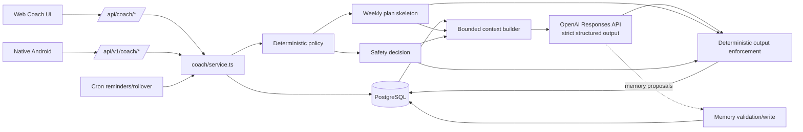
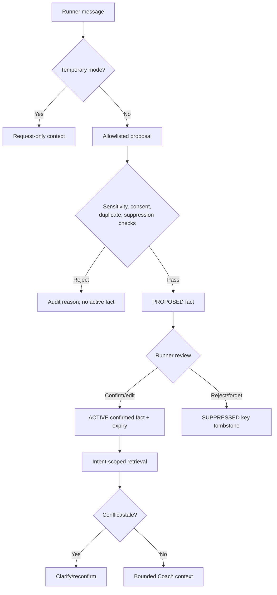

# ZidRun AI Running Coach — Unified Codex + Fable Review

**Review date:** 2026-08-02  
**Repository revision reviewed:** `abee6f1`  
**Source reviews:** `coach_review_codex.md` and `coach_review_fable.md`  
**Authority:** repository code and approved product/release references override either review when they disagree. `EXECUTION_PLAN.md` remains the only progress, priority, and release-gate tracker; this document is a synthesized assessment, not a competing tracker.

**Evidence notation:**

- **Confirmed** — directly supported by code, schema, tests, approved screenshots, or governing docs.
- **Qualified** — directionally useful, but severity, scope, or consequence needs correction.
- **Rejected** — contradicted by repository evidence or unsafe as proposed.
- **Untested** — requires live provider, production, browser, emulator, physical-device, or user evidence.
- **Recommended** — proposed future behavior, not current implementation.

## 1. Executive Summary

### Overall quality score: 6.0/10

Both reviews agree on the central conclusion: ZidRun Coach has a better-than-typical architecture, but it is not ready to be presented as production-grade personalized training guidance. The strongest decision is the separation between a deterministic training/safety engine and an LLM explanation layer. The weakest areas are safety input coverage, health-data governance, memory semantics, training-plan intelligence, and cross-client lifecycle consistency.

Fable adds meaningful product-local insight—macro-plan visibility, Darija register, optional fasting-aware scheduling, proactive review moments, native web-handoff friction, and the TTS endpoint boundary. Codex adds the more serious control-flow findings that Fable missed: current chat text bypasses deterministic symptom triage, consent is not auditable, dismissed memory can be relearned, AI-extracted facts become active without confirmation, and goal edits can leave a stale plan.

### Unified top findings

1. **P0 — Current chat text is absent from deterministic urgent-symptom screening.** `createCoachInteraction()` evaluates a selected/recent run and goal injury notes, not `input.message` (`src/lib/coach/service.ts:1093-1104`). `evaluateCoachSafety()` scans only run symptoms/notes (`src/lib/coach/safety.ts:34-45`).
2. **P0 — Health/AI consent is not persisted or enforceable.** The checkbox is local UI state and editing assumes consent (`src/components/coach/coach-goal-form.tsx:78-86`, `:461-488`); there is no versioned consent model in the Coach schema.
3. **P1 — Memory does not honor the user-control promise.** Dismissed rows are left in place, but `writeMemories()` never checks them before inserting a new `ACTIVE` fact (`src/lib/coach/memory-store.ts:52-74`). Extracted facts are also auto-activated as `AI_INFERRED` without review (`src/lib/coach/service.ts:1251-1268`).
4. **P1 — The planner is safe but materially under-personalized.** Target time, custom distance, recent race result, sleep, nutrition, terrain/constraints, age, HR/cadence, and session-time limits do not shape the deterministic week (`src/lib/coach/adaptive-planner.ts:28-44`; `src/lib/coach/service.ts:850-869`).
5. **P1 — Goal and plan lifecycle can become inconsistent.** Material goal/health/availability edits leave the active plan unchanged (`src/lib/coach/service.ts:262-304`), and web/native use different first-plan activation semantics.
6. **P1 — Interaction delivery is not retry-safe.** The synchronous generation endpoint has no client request ID or uniqueness invariant, so a timeout/retry can duplicate model calls, quota consumption, or draft plans.
7. **P1 — The TTS boundary accepts arbitrary authenticated text without Coach entitlement or usage accounting and caches generated audio under public uploads.** The route is intended for fixed guided cues but accepts any ≤200-character string (`src/app/api/coach/tts/route.ts:8-39`; `src/lib/coach/tts.ts:10-67`).
8. **P1 — There is no systematic Coach-quality evaluation loop.** Operational counts exist, but product usefulness, safety recall, groundedness, plan-diff quality, memory corrections, and cross-client behavior are not measured.
9. **P2 — Local product differentiation is incomplete.** Approved Arabic copy is Algerian Darija, yet the AI prompt only receives locale `ar`; Coach has no explicit Darija/Arabizi register rule. Coach also has no optional, privacy-safe fasting schedule mode.
10. **P2 — Native parity and operations remain incomplete.** The repository tracks missing native voice and memory/privacy surfaces, a dead remote Coach flag, a native-to-web login wall, trial detail, and dated production Coach API gaps in `EXECUTION_PLAN.md` and `docs/NATIVE_ANDROID_OPTION_PLAN.md`.

### Final verdict

Keep the deterministic-core/LLM-voice architecture. Do not add a larger model, autonomous agent, health memory, or proactive AI generation before the P0 safety/consent work, memory controls, idempotency, and plan lifecycle are correct. The next differentiation layer should be transparent plan adaptation and a visible road to race day—not more chat volume.

## 2. Review of the Fable Report

### Findings incorporated as confirmed

| Fable finding | Verdict | Unified treatment |
|---|---|---|
| Deterministic engine owns numbers; LLM explains. | **Confirmed.** `adaptive-planner.ts` owns load/dates/pace and `enforceCoachSafety()` replaces model workouts. | Preserved as the target architecture's foundation. |
| No visible macro plan to race day. | **Confirmed.** Only one-week `TrainingPlan` instances exist; phase/weeks-to-race are computed but no roadmap is persisted or rendered. | Added as a high-value Phase 2 feature with indicative, non-committed future weeks. |
| `targetTimeSeconds` does not drive deterministic pacing or feasibility. | **Confirmed.** It is stored/contextualized but absent from `AdaptivePlannerInput`. | Merged with goal feasibility and pace-band work. |
| Proactive Coach content is static. | **Confirmed.** Jobs send fixed reminder/nudge/expiry copy; `WEEKLY_REVIEW` is runner-triggered. | Added after safety, idempotency, notification consent, and evaluation—not as an immediate cron model call. |
| AI Arabic register is not told to use Darija/Arabizi. | **Confirmed.** Product flow mandates Algerian Darija (`docs/coach-design/COACH_DESIGN_FLOW.md:249`); `openai.ts` only says requested language. | Added as a small prompt/evaluation improvement. |
| Personal records are computed but absent from Coach context. | **Confirmed.** `records.ts` feeds Runs/badges; `context.ts` has no records/PB block. | Add canonical derived record signals, not “performance memory.” |
| Native remote Coach flag is dead; web handoffs require another browser login; native manual/GPX actions are incomplete. | **Confirmed and already tracked.** `EXECUTION_PLAN.md` has `RUNPAR-006`, `NATPAR-002`, and related native findings. | Included as parity/dependency findings without creating a new tracker. |
| TTS lacks an entitlement boundary. | **Confirmed, with a deeper issue.** It also accepts arbitrary text and writes shared audio to `public/uploads/tts-audio`. | Recommend cue IDs/allowlist, budget/accounting, and non-public handling—not only entitlement. |

### Findings retained with qualifications

| Fable claim | Verdict | Correction |
|---|---|---|
| Onboarding is a “giant form” and a blocker. | **Qualified.** Both web and native implement the approved five-step flow; file length is not proof of a single long form. It still asks many optional fields before first value and lacks progressive profiling after onboarding. | Treat as P2 UX/product improvement, not a release blocker. Preserve the approved five-step structure while asking only fields that change the first plan. |
| Ramadan support is absent and a market-defining blocker. | **Qualified.** Coach implementation has no fasting-aware schema/planner/prompt behavior; marketing mentions Ramadan once. No approved product requirement makes it a release blocker, and storing religious observance would introduce sensitive data. | Offer optional temporary **fasting schedule mode** without inferring religion or storing a permanent belief attribute. P2 differentiation after consent/safety. |
| Follow-up answers “evaporate.” | **Qualified.** They remain in the interaction and bounded six-turn history and may become memory candidates, but they do not reliably update structured goal/domain fields. | Add explicit progressive-slot updates with user confirmation. |
| Conversation needs threads and a dedicated extraction pass. | **Qualified.** Six summarized turns are lossy, but threads/another model call add retention, cost, and governance complexity. | First render/use the existing follow-up field and confirmed memory proposals. Add rolling threads only when evaluation proves continuity failure. |
| Prompt layout wastes cache and a new layout saves 25%. | **Qualified.** `request` is serialized first (`src/lib/coach/context.ts:120-125`), so volatile content likely limits prefix reuse beyond static instructions. Exact hit rate and savings were not measured. | Reorder stable/volatile sections and measure cached-token ratio before claiming savings. |
| One shared prompt for four interaction types is inefficient. | **Qualified.** The prompt contains type-specific rules and duplication, but no quality/token experiment proves severity. | Split shared policy from type-specific suffixes as a measured P2 optimization. |
| Structured quality workouts are missing. | **Qualified.** Plan prose is generic, but `workout-structure.ts:77-143` already derives executable interval/tempo steps at runtime. The gap is that the planner does not persist a goal-specific prescription; runtime derivation may not represent the intended session. | Add planner-owned structured prescription/versioning rather than a second unrelated structure engine. |
| Older runners need lower `MAX_RUN_DAYS`. | **Qualified and already an open product decision (`COACHPAR-004`).** Age is absent from the planner, but arbitrary age caps are not evidence-based personalization. | Prefer observed recovery, training history, availability, and sports-science review; define age/minor policy before changing plans. |

### Findings rejected or excluded

| Fable claim/proposal | Verdict | Reason |
|---|---|---|
| “Dismissed facts are never re-learned.” | **Rejected.** | `writeMemories()` does not query `DISMISSED`; it inserts a new active row after updating only active rows (`memory-store.ts:52-74`). |
| Health/injury memory is mostly a policy task plus a one-line code change. | **Rejected as unsafe.** | `SEC-002` requires inventory, purpose, consent, retention, export/delete, and provider handling. Health state should live in a dedicated, confirmed, expiring domain record—not general model-derived memory. |
| Add `observesRamadan Boolean` to `RunnerGoal`. | **Rejected in that form.** | It stores a sensitive religious-observance proxy indefinitely. A temporary user-initiated fasting schedule preference achieves the training goal with less sensitive data. |
| Auto-write a second model's extracted facts through the unchanged memory path. | **Rejected.** | The existing path already auto-activates misclassified facts. Extraction must create `PROPOSED` facts for user confirmation and honor suppression. |
| Treat native voice/memory/manual-run gaps as new P0s. | **Rejected severity.** | `EXECUTION_PLAN.md` is authoritative and tracks these as P2/P3 parity items. They remain required before claiming full parity, but they do not supersede current P0 release gates. |
| Exact monthly AI costs and hypothetical Claude migration economics. | **Excluded from the merged evidence.** | Usage mix, output distribution, cache-hit rate, exchange rate, and external pricing were not measured/verified. The current product uses OpenAI; model migration is not needed to answer this review. |
| “No queue except localStorage.” | **Rejected as a repository-wide statement.** | Native run recovery has an app-private durable outbox; server Coach generation still lacks a durable job/status queue. |

## 3. Scope, Evidence, and Limitations

### Reviewed

- Governing references: `EXECUTION_PLAN.md`, `PRODUCT.md`, `CODEX_CONTEXT.md`, `AGENTS.md`.
- Coach references: `docs/COACH_CONTEXT_DATA_CONTRACT.md`, `docs/coach-design/COACH_DESIGN_FLOW.md`, and all five approved v2 screenshots at original resolution.
- Mobile references: `docs/MOBILE_ANDROID.md`, `docs/NATIVE_ANDROID_OPTION_PLAN.md`, and the current native parity entries in `EXECUTION_PLAN.md`.
- Web and mobile APIs: `src/app/api/coach/**`, `src/app/api/v1/coach/**`, shared v1 DTO shaping.
- Domain/AI: `src/lib/coach/**`, Coach schemas, services, context, memory, planning, safety, usage, subscriptions, reminders, weather/elevation/nutrition/audio.
- Web UI: goal, dashboard, overview, plan, conversation, runs, sleep, memory, nutrition, audio, subscriptions.
- Native UI/network: `native-android/feature/coach/**`, `ZidRunApi.kt`, DTOs, repositories, shell/navigation, native run handoffs.
- Persistence: Coach-related Prisma models/enums/migrations.
- Admin, analytics, crons, environment/config, feature flags, TODO/FIXME searches, and Coach test suites.

### Verification inherited from the Codex review

- `scripts/test-coach.ts` — passed.
- `scripts/test-coach-context.ts` — passed.
- `scripts/test-adaptive-planner.ts` — 68/68 passed.
- `scripts/test-coach-memory.ts` — 36/36 passed.
- `scripts/test-workout-structure.ts` — passed.
- `scripts/test-coach-mobile.ts` — not runnable as a reliable contract test without `DATABASE_URL` and a live server/database.

### Confidence and limitations

- **High confidence:** static safety-input flow, consent persistence absence, memory lifecycle defect, planner inputs, TTS boundary, API/client behavior differences, prompt/context shape, and tracked native gaps.
- **Medium confidence:** UX friction, usefulness of proactive touchpoints, macro-plan retention effect, Darija quality, fasting-mode demand, and real-world training value.
- **Untested:** live OpenAI answer quality, production cost/cache hit rate, current production v1 status after the dated 2026-08-01 probe, browser pixel parity, native device accessibility/performance, notification delivery/deep links, and legal sufficiency.
- The optional `impeccable` visual-review skill referenced by the ZidRun skill was unavailable. The approved screenshots were inspected directly at original resolution, but no live browser/emulator comparison was captured in this synthesis.

## 4. Current Architecture



### Current interaction pipeline

1. Authenticate and require an active goal.
2. For chat, run topicality before spending entitlement.
3. Enforce trial/subscription quota.
4. Load valid recent runs and compute metrics, consistency, intensity, adherence, active plan, and memory.
5. Evaluate safety from selected/recent run, goal injury notes, metrics, and chronic conditions—but not the current chat message.
6. Generate a deterministic one-week skeleton.
7. Load target race, weather, 14-day sleep, nutrition, and six prior exchange summaries.
8. Build versioned/hashable context, capped near 14,000 characters.
9. Call OpenAI once with strict Zod output, `store:false`, timeout/retry, prompt/cache metadata.
10. Replace model workouts with the deterministic skeleton and apply safety reductions.
11. Persist interaction, usage, optional draft plan, and non-fatal memory candidates.

### Current product loop

- Goal onboarding → first plan generation/activation.
- Today view → workout execution/logging.
- Run matching → adherence and completion state.
- Post-run analysis and chat.
- Sleep/nutrition/weather context.
- Weekly deterministic rollover and static reminders.
- Runner memory inspection on web.
- Admin usage/subscription/human-note operations.

## 5. What Works Well

1. **Correct authority split:** deterministic code owns dates, load, pace targets, and reductions; the LLM owns language and explanation.
2. **Conservative weekly planning:** observed volume replaces stale declared volume, progression is bounded, pain/fatigue/missed sessions reduce load, and no catch-up is added.
3. **Strict AI contracts:** bounded Zod schemas, prompt/version/context hashes, `store:false`, token/cost logs, and failed-output handling.
4. **Useful context breadth with explicit minimization:** goal, runs, splits, adherence, plan, sleep, nutrition, weather, race, conversation, and memory, while excluding email/phone/national ID/raw GPS.
5. **Good run/adherence integrity:** suspect non-foot activity is excluded; matching is conservative; ambiguous matches require confirmation.
6. **Strong locale and design foundations:** approved five-screen Coach system, three themes, en/fr/ar, RTL, accessible live states, and mobile-first hierarchy.
7. **Real native implementation:** native screens call shared server authority instead of reimplementing training/AI rules in Kotlin.
8. **Useful runner controls:** plan accept/skip/move, voice transcript review before send on web, run analysis reuse, memory inspect/confirm/forget/export/delete.
9. **Operational basics:** entitlement, quotas, rate limits, provider usage logs, cron dedupe, subscription admin, and content-free ops reporting.
10. **Hybrid coaching foundation:** human notes have author provenance and are visually distinguished; the prompt recognizes human-coach memory while retaining a safety exception.

## 6. Unified Findings and Risks

Priority uses ZidRun's review scale: **P0** release blocker, **P1** major safety/product failure, **P2** meaningful gap, **P3** polish/optimization. Effort: **S**, **M**, **L**, **XL**.

| ID | Area | Finding | Evidence | Impact | Priority | Effort | Acceptance condition |
|---|---|---|---|---|---|---|---|
| UCF-001 | Safety | Current chat message bypasses deterministic urgent-symptom triage. | `service.ts:1093-1104`; `safety.ts:34-45`. | Acute-risk text can reach the model under `CLEAR`. | P0 | S | EN/FR/Darija/Arabizi red-flag chat cases block before entitlement/model call and emit reviewed escalation. |
| UCF-002 | Consent/privacy | Health/AI consent is UI-only and editing assumes it. | `coach-goal-form.tsx:78-86`, `:461-488`; no consent model in `schema.prisma`. | No auditable purpose, version, revocation, or provider-processing grant. | P0 | L | Every sensitive write/provider call requires active purpose-specific consent; grant/withdraw/export/delete E2E passes. |
| UCF-003 | Memory control | Dismissed/deleted facts can be relearned. | `memory-store.ts:52-74`, `:184-187`. | “Forget” is not durable. | P1 | M | Suppression tombstone blocks repeat extraction; DB lifecycle tests pass. |
| UCF-004 | Memory provenance | Model-extracted runner statements become active `AI_INFERRED` facts without confirmation. | `openai.ts:238`; `service.ts:1251-1268`. | Mis-extraction silently affects future advice and provenance is confusing. | P1 | M | Candidate is `PROPOSED`; exact value is editable/confirmable; only confirmed fact enters context. |
| UCF-005 | Plan lifecycle | Material goal/health/availability edits leave active plan untouched. | `service.ts:262-304`; v1 goal route comments at `:51-57`. | Stale or incompatible workouts remain actionable. | P1 | M | Material edits pause/invalidate affected sessions and show a reasoned diff before reactivation. |
| UCF-006 | Cross-client lifecycle | Web requires an AI draft/acceptance while native creates an active rule-based week after onboarding. | `coach-plan-panel.tsx:99-138`; `api/v1/coach/goals/route.ts:95-117`. | Same action has different commitment semantics. | P1 | M | One preview/accept/active contract produces identical status/version across web/native. |
| UCF-007 | Training intelligence | Target time/distance, recent result, recovery, constraints, age, and several collected signals do not drive deterministic planning. | `adaptive-planner.ts:28-44`; `service.ts:850-869`. | Distinct runners/goals can receive materially similar plans. | P1 | L | Validated profile matrix demonstrates goal/readiness/constraint differences with invariant compliance. |
| UCF-008 | Goal visibility | No indicative macrocycle/roadmap to race day exists. | One-week plans; `weeksToRace` only drives phase in `adaptive-planner.ts:137-202`. | Runner cannot see the route to the goal or distinguish committed week from future direction. | P2 | L | UI shows phase blocks/volume ranges as indicative; only accepted current week is executable. |
| UCF-009 | Reliability/cost | Interaction creation is synchronous and lacks idempotency. | `api/coach/interactions/route.ts:27-38`; v1 route documents long wait/client timeout. | Duplicate calls, quota, plans, or unseen completed responses. | P1 | M | Unique `(userId, clientRequestId)` resumes one durable interaction and one provider charge. |
| UCF-010 | TTS/privacy/cost | TTS accepts arbitrary text, has no Coach entitlement/usage log, and stores audio in public uploads. | `api/coach/tts/route.ts:8-39`; `coach/tts.ts:10-67`. | Authenticated abuse can create billed/publicly served arbitrary audio beyond intended cues. | P1 | M | Accept fixed cue IDs or strict templates; enforce tier/budget; account misses; store outside public user media. |
| UCF-011 | Safety policy | Safety taxonomy is narrow and no resolved minor/age policy exists. | `safety.ts:30-66`; `schemas.ts:18-82`; `COACHPAR-004`. | Important illness/heat/eating/medication/age cases depend on model prose. | P1 | L | Reviewed multilingual taxonomy and age/minor policy pass golden recall/false-positive targets. |
| UCF-012 | Conversation UX | Web hides recovery advice, used signals, gaps, and follow-up; native renders most of them. | Web `coach-conversation.tsx:324-340`; native `ConversationScreen.kt:321-366`. | Web reply feels less transparent and useful than native for the same response. | P2 | S | Intentional render policy is shared; “Based on,” gaps, recovery, and follow-up pass accessibility/RTL. |
| UCF-013 | Continuity/profile | Six summarized turns and inline extraction do not reliably update structured runner state. | `service.ts:1156-1173`; `context.ts:179-187`; memory candidate cap. | Coach can repeat questions or miss durable schedule/terrain corrections. | P2 | L | Confirmed answers update canonical slots; repeated-question and correction evals meet target before threads are added. |
| UCF-014 | Onboarding | Approved five steps still collect many optional fields before the first useful plan. | `coach-goal-form.tsx` and native `CoachOnboardingScreen.kt`, each 807 lines; schema has ~25 fields. | Higher setup effort and unclear value of sensitive optional inputs. | P2 | M | First plan needs only high-value fields; optional questions are progressive and show purpose. |
| UCF-015 | Localization | AI prompt does not specify approved Algerian Darija/Arabizi register. | `COACH_DESIGN_FLOW.md:249`; `openai.ts:202-239`. | AI can answer in MSA while surrounding product uses Darija. | P2 | S | Native-speaker rubric passes Arabic-script Darija and common Arabizi inputs without unsafe ambiguity. |
| UCF-016 | Local scheduling | No Coach fasting-aware training mode exists. | No Coach schema/planner/prompt support; only marketing mention. | Fasting runners must manually reinterpret timing, hydration, and intensity advice. | P2 | L | Optional temporary mode, no religion inference, consented schedule preference, deterministic heat/intensity safeguards, locale QA. |
| UCF-017 | Workout prescription | Plan quality-session prose is generic while executable structure is derived later from type/distance. | `adaptive-planner.ts:450-506`; `workout-structure.ts:77-143`. | Derived reps may not express the planner's goal/phase intent. | P2 | L | Planner emits versioned structured session; UI/audio execute exactly that prescription. |
| UCF-018 | Proactivity | Weekly review and post-run touchpoints require user action; cron content is static. | `reminders.ts`; no scheduled `createCoachInteraction()` call. | Subscription may feel passive, but automatic AI could be intrusive/costly. | P2 | M | Opt-in deterministic weekly summary + optional AI explanation, quiet hours, idempotency, budget, and helpfulness measurement. |
| UCF-019 | Performance context | PB/streak records are canonical but absent from Coach context. | `records.ts`; `service.ts:973-1046`; no record block in `context.ts`. | Coach misses meaningful progress signals. | P2 | S | Bounded derived record summary with source/date enters relevant intents; no duplicate memory. |
| UCF-020 | Prompt/cache | One broad prompt and request-first JSON reduce specialization/prefix stability; exact cost effect is unmeasured. | `openai.ts:202-239`; `context.ts:120-125`. | Potential token waste and diluted small-model attention. | P2 | M | Per-intent prompt experiment improves rubric or token/cache metrics before rollout. |
| UCF-021 | Analytics/eval | Ops reporting lacks Coach product and safety quality evaluation. | `coach/report.ts`; no helpfulness/memory correction/plan-diff/safety recall event model. | Regressions and weak personalization are invisible. | P1 | L | CI golden suites plus content-free production metrics exist before deeper automation. |
| UCF-022 | Config/ops | Trial copy, env keys, model costing, and native feature flag disagree with effective code. | `.env.example:52-53`; `CODEX_CONTEXT.md:51`; `entitlement.ts:18-28`; `admin/coach/page.tsx:60`; `openai.ts:242-247`; v1 config/AppShell. | Misconfiguration, wrong user/admin expectations, ineffective incident control. | P1 | S | One typed config source drives runtime, docs, admin, client flags, and cost status. |
| UCF-023 | Native parity | Memory/privacy and voice are absent natively; production endpoint parity has only dated evidence. | `COACHPAR-001/002`; Native Option Plan Phase 8. | Native-only users lack controls/features and may hit deploy drift. | P2 | L | Production probes pass; memory and voice states pass signed-device locale/theme matrix. |
| UCF-024 | Native handoff | Coach subscription opens protected web UI without transferring native bearer identity. | `AuthRepository.kt:81-85`; `ZidRunApp.kt:222-225`; `NATPAR-002`. | Native-only runner must sign in again on the payment path. | P2 | M | Single-use, short-lived, allowlisted web-session handoff lands directly on subscribe and rejects replay. |
| UCF-025 | Native run inputs | Manual entry and GPX import controls route to history; Coach adaptation loses non-GPS activity. | `AppShell.kt:142-156`; native Runs screen controls. | Treadmill/watch/manual runners have incomplete training state. | P2 | L | Implement flows or hide controls; imported/manual runs retain source/quality and feed shared validity rules. |
| UCF-026 | Plan audit | `acceptedAt` is unused and `AI_ASSISTED` labels deterministic workouts as AI-owned. | `schema.prisma:819`; `service.ts:1497-1535`. | Approval and change provenance are unclear. | P2 | M | Persist generated/accepted actor/time, planner/policy versions, diff reasons, and accurate source. |
| UCF-027 | Reminders | No per-user Coach time/quiet-hour settings. | `reminders.ts` and env cooldowns. | Useful reminders may arrive at poor times and be muted. | P3 | M | User controls channel/time/quiet hours; opt-out and delivery metrics verified. |

## 7. Missing Features, Correctly Prioritized

### Required for a credible first release

- Current-message deterministic safety triage and reviewed escalation copy.
- Purpose-specific health/AI/voice/memory consent with withdrawal and retention enforcement.
- Confirm-before-use memory plus durable suppression/temporary mode.
- Idempotent, recoverable interaction creation.
- Unified plan preview/accept/active lifecycle and material goal-edit invalidation.
- Accurate config/trial/cost behavior and bounded TTS cue interface.
- Coach-quality/safety evaluation baseline.
- Re-probed production v1 Coach contracts before any native acceptance claim.

### High-value after the foundation

- Target-time feasibility and pace bands based on validated recent performance.
- Explainable readiness policy using recovery/load with data-quality confidence.
- Indicative macro plan to race day with current-week commitment clearly separated.
- Progressive profiling and canonical answer slots.
- Planner-owned structured quality sessions.
- Web structured-response parity with native.
- Canonical PB/streak signal in relevant Coach context.
- Opt-in weekly summary/review with plan diff.
- Darija/Arabizi response register evaluation.
- Optional privacy-safe fasting schedule mode.

### Good-to-have

- Thread/session summaries once evaluation proves six-turn continuity insufficient.
- Per-intent prompt variants and measured cache optimization.
- Human-coach reviewed plan proposals with runner consent and clear authority.
- Health Connect/wearables after data governance and source-quality policy.
- Native voice reply playback after TTS boundary and consent are fixed.
- Per-user reminder schedules and quiet hours.

### Deliberately postpone

- Autonomous model tools or direct plan/database mutation.
- Generic health/injury memory written by a model.
- Diagnosis, treatment, medication, or rehabilitation prescriptions.
- A larger-model migration without controlled response-quality evidence.
- Embeddings/vector retrieval before structured memory quality demands it.
- Opaque age-based plan reductions without qualified sports-science review.
- ACWR or other “overtraining scores” presented as medical certainty.

## 8. Recommended Runner Experience

1. **Start safely:** collect goal, date, experience, recent volume, availability, and current risk state. Ask sensitive optional fields only with clear purpose and persisted consent.
2. **Show feasibility honestly:** target-time pace, recent-performance estimate, confidence, and data gaps. Offer finish/realistic/stretch framing without promising outcomes.
3. **Preview one committed week:** show load, hard/easy balance, recovery, and “why.” Require the same explicit acceptance on web/native.
4. **Show the road ahead:** render phase blocks and indicative weekly ranges to race day. Label them as adaptable, not scheduled commitments.
5. **Make Today the home:** workout, effort/pace range, exact session structure, recovery state, one explanation, one action.
6. **Close the feedback loop:** after a run, compare planned vs actual distance/duration/pace/RPE/pain/fatigue and say whether the next week will change.
7. **Adapt transparently:** material changes show old → new, reason codes, and approval. Safety reductions/pause apply immediately and cannot be rejected into a harder plan.
8. **Use conversation to explain:** display concise answer, “Based on,” missing data, recovery actions, and one follow-up. Chat prose never silently changes the accepted plan.
9. **Remember only with permission:** show “Remember this?” for eligible non-health facts; edit/confirm/reject, Temporary chat, and “do not relearn.”
10. **Be locally useful:** Darija-appropriate replies and optional temporary fasting scheduling without inferring religion.
11. **Be proactive only by consent:** a deterministic weekly recap can arrive first; AI explanation is opt-in, budgeted, quiet-hour-aware, and measurable.

## 9. Context and Memory Architecture

### Recommended taxonomy

| Context class | Examples | Lifetime | Authority/storage |
|---|---|---|---|
| Request-local | Current question, run under review | Request | Interaction/run; never durable memory by default. |
| Recent episodic | Last runs, current week, recent exchanges | 7–28 days | Bounded structured domain data. |
| Profile/core | Locale, units, age band/sex when consented | User edit | Canonical profile. |
| Goal/plan | Goal, race, phase, accepted plan, adherence | Goal/plan lifecycle | Versioned domain tables. |
| Derived performance | Volume, pace, PBs, streak, readiness | Recomputed/versioned | Metrics snapshot/record service, not memory. |
| Durable preference | Time, terrain access, tone | 90–365 days | Confirmed Coach memory. |
| Sensitive health/recovery | Injury, condition, symptoms, sleep | Purpose-limited | Dedicated consented domain record; never general model memory. |
| Temporary schedule mode | Fasting, travel, exceptional week | Explicit short window | Goal/schedule exception with expiry; no belief inference. |
| Governance | Consent, safety action, suppression, deletion | Policy retention | Append-only auditable events. |

### Recommended schema direction

```text
CoachConsent
  userId, purpose, dataCategory, policyVersion, status
  grantedAt, withdrawnAt, expiresAt, sourceClient

CoachMemoryFact
  userId, goalId?, kind, canonicalKey, valueJson
  source, sourceRef?, confidence, sensitivity
  status(PROPOSED|ACTIVE|SUPERSEDED|DISMISSED|SUPPRESSED|EXPIRED)
  confirmedAt?, expiresAt?, createdAt, updatedAt

CoachMemoryEvent
  factId?, userId, action, actor, reason?, createdAt

RunnerHealthContext
  userId, goalId?, category, structuredValue, severity?
  source(USER_CONFIRMED|RUN_LOG), consentId, validFrom, expiresAt
  never populated from model inference alone

TrainingRoadmap
  goalId, plannerVersion, generatedAt
  phase blocks and indicative weekly volume ranges
  current accepted TrainingPlan remains separate

CoachContextTrace
  interactionId, contextVersion, plannerVersion, safetyPolicyVersion
  selectedFactIds[], includedSections[], omittedReasons, hash
  rawPromptStored=false
```

### Extraction, merge, and suppression

1. Detect explicit “remember,” “forget,” “do not store,” and Temporary mode deterministically.
2. Let the response model or later low-cost extractor only **propose** allowlisted non-health facts.
3. Validate kind, scope, sensitivity, consent, length, duplication, and suppression.
4. Store `PROPOSED`; show exact text for confirm/edit/reject.
5. Confirmation creates an active user-confirmed fact. Rejection creates a value-free suppression tombstone.
6. Current explicit input overrides old memory for the request; safety state overrides all sources.
7. User-confirmed facts outrank system-derived signals and AI proposals. Human-coach advice cannot override safety policy.
8. Conflicts are never silently merged; ask one clarification or show the correction.

### Retrieval

- Filter by user, goal/scope, consent, status, sensitivity, expiry, and intent.
- Prefer confirmed/recent/authoritative sources.
- Select 6–8 relevant facts; include source, confidence, and age.
- Persist selected fact IDs and omission reasons, not the raw prompt.
- Use structured retrieval before adding embeddings.



## 10. AI Orchestration and Prompt Strategy

### Deterministic responsibilities

- Auth, authorization, consent, entitlement, quotas, idempotency, audit.
- Topicality, intent, current-message safety, age/minor policy.
- Goal feasibility, phases, load, recovery weeks, dates, rest spacing, workout structure, pace ranges.
- Readiness reductions, weather/heat/fasting schedule safeguards.
- Plan diff, acceptance, rollback, and source/version provenance.
- Planned-vs-actual classification.
- Memory proposal validation, suppression, confirmation, expiry.
- TTS cue allowlist, provider budgets, storage/retention.

### LLM responsibilities

- Explain deterministic decisions in the chosen register.
- Summarize progress and uncertainty.
- Ask one useful clarification.
- Propose non-health memory and plan-language improvements without writing them.
- Translate a machine-readable plan diff into clear coaching language.

### Prompt improvements worth testing

1. Shared safety/authority core plus suffixes for `INITIAL_PLAN`, `WEEKLY_REVIEW`, `POST_RUN`, and `CHAT`.
2. Explicit Darija/Arabizi register rule for `ar`, validated by native speakers.
3. Remove the tension between “always congratulate/always recovery checklist” and “do not repeat”; choose one or two run-specific recovery levers.
4. Until deterministic feasibility ships, the model may explain implied target pace only as context—not prescribe it as a workout target.
5. Generate the memory-kind prompt line from the same allowlist used by application validation.
6. Reorder context from stable dossier to volatile request and measure cached-token ratio. Do not claim a saving before measurement.

### Recommended request lifecycle

```mermaid
sequenceDiagram
    participant C as Client
    participant A as Coach API
    participant D as Deterministic policy
    participant DB as Database
    participant L as LLM

    C->>A: POST interaction + clientRequestId
    A->>DB: Resolve/replay request; auth, consent, quota
    A->>D: Intent + current-input safety
    alt blocked or consent absent
        D-->>A: Reviewed deterministic response
        A-->>C: Block/limited mode; no model call
    else allowed
        A->>DB: Load bounded canonical context
        A->>D: Plan/readiness/safety/roadmap state
        A->>L: Versioned prompt + structured context
        L-->>A: Strict explanation + proposals
        A->>D: Enforce schedule/safety/memory policy
        A->>DB: Persist result, trace, usage, proposals
        A-->>C: Completed result or resumable status
    end
```

No autonomous tool calling is recommended for the credible release. If introduced later, tools should be read-only or proposal-only; model output must never directly mutate plans, health state, or memory.

## 11. Training Engine

### Current deterministic strengths

- Goal-type-specific long-run share, quality bias, volume multiplier, and cap.
- Phase selection from target date.
- Experience floors/ceilings and run-day limits.
- Observed 7/28-day volume anchors after sufficient history.
- Bounded pace derived from recent average; no pace without a valid anchor.
- Return-from-break, pain, fatigue, and missed-session reductions.
- Availability and preferred long-run day scheduling.
- No adjacent quality days and no quality immediately before long run (`adaptive-planner.ts:398-413`).
- Runtime executable workout steps and guided audio.

### Needed layers

1. **Feasibility:** validated recent-effort estimate, target pace, confidence, and honest goal range.
2. **Macrocycle:** phase blocks, cutback/recovery, taper, minimum preparation, race roadmap.
3. **Readiness:** recent pain/fatigue, sleep trend, illness, workload, adherence, and data-quality state.
4. **Constraints:** time budget, surface/equipment, travel/fasting exception, preferred schedule.
5. **Prescription:** planner-owned reps/sets/recovery/pace or effort ranges, persisted and versioned.
6. **Feedback:** planned-vs-actual distance, duration, pace/effort, RPE, pain/fatigue, and reason.
7. **Diff:** machine-readable change reasons, old/new values, and acceptance state.

### Guardrails

- Never add catch-up mileage.
- Never place hard/long sessions together without a validated exception.
- Never prescribe goal pace without a valid anchor.
- Never increase load under unresolved pain/illness/low recovery confidence.
- Never let AI prose make a deterministic session harder.
- Never encode age, religion, sex, or health assumptions as opaque reductions; use explicit policy, consent, and evidence.
- Never present ACWR/readiness as diagnosis or certainty.

## 12. UX, Localization, and Approved Designs

### Approved design assessment

The five v2 screens remain a strong direction: clear first-glance purpose, one dominant action, compact metrics, restrained health/privacy styling, and an athletic visual system. The weekly mockup's precise `5 × 800 m` prescription also exposes the implementation gap: the current planner writes generic interval prose and the execution layer derives default 400 m reps later.

### Unified UX changes

- Keep the approved five-step onboarding but defer optional questions that do not change week one.
- Show “why this field” for health/body/history and never silently submit it before consent.
- Make Today the primary surface; plan and conversation support it.
- Render the structured response consistently across web/native.
- Separate advice from actual plan changes.
- Show roadmap phases without pretending future weeks are committed.
- Show exact plan diffs after recovery/goal/availability changes.
- Preserve draft text and request ID across timeout/offline/app restart.
- Bring memory/privacy, voice states, and trial detail to native at the tracked parity priority.
- Fix native web handoff so subscription/support/security do not require an avoidable second login.

### Darija and fasting mode

- `ar` responses should be evaluated for warm Algerian Darija in Arabic script; common Arabizi input must be understood without blindly mirroring unsafe ambiguity.
- French running terms natural in Algeria may remain where they improve clarity.
- Fasting support must be optional and temporary. Ask about training schedule constraints, not religious identity. Let the runner choose a time window and expiry.
- Apply deterministic timing/heat/intensity safeguards; the model explains them and shifts hydration/fuel guidance to the chosen eating window without medical claims.

## 13. Safety, Privacy, and Trust

### Immediate gates

1. Scan current message and all health-adjacent free text before the model.
2. Persist purpose-specific consent before health storage/provider processing.
3. Define reviewed EN/FR/Darija/Arabizi escalation copy and minors policy.
4. Make forgotten memory stay forgotten and require confirmation before use.
5. Replace free-text TTS with controlled cues and non-public/provider-accounted handling.

### Health context policy

Health/injury continuity is valuable, but general memory is the wrong storage boundary. Use a dedicated structured record with:

- explicit user confirmation and purpose;
- source and validity period;
- conservative expiry/reconfirmation;
- inspect/edit/delete/export;
- separate provider-processing consent;
- no model-only inference;
- safety policy that can use current structured state before the model.

### Human coach policy

Human notes already exist, but future collaboration needs runner consent, scoped role/organization authorization, provenance, expiry, audit, and an explicit rule that neither human nor AI notes override current safety state. `humanCoaching` should not by itself grant broad access to all Coach/health/run records.

## 14. Native and Capacitor Parity

The authoritative status is in `EXECUTION_PLAN.md`; the combined review does not reassign those gate IDs.

| Area | Current evidence | Unified recommendation |
|---|---|---|
| Voice/TTS | Native composer lacks voice/TTS (`COACHPAR-001`, P2). | Fix TTS boundary first; then add permission, record/transcribe/review/send, and reply playback states. |
| Memory/privacy | No native memory API/screen (`COACHPAR-002`, P2). | Add v1 facade and native inspect/confirm/edit/forget/export/delete/Temporary controls with cross-user tests. |
| Goal edit | Native edit is implemented/closed, but shared behavior leaves active plan unchanged. | Preserve edit parity; fix shared material-change invalidation. |
| Age policy | Open `COACHPAR-004`, P2. | Sports-science/product decision; prefer recovery/history signals over arbitrary age bands. |
| Trial detail | Native has data but shows only a basic state (`COACHPAR-005`, P3). | Show remaining days/usage without crowding 320 dp. |
| Remote flag | `features.coach:false` is not consumed (`RUNPAR-006`, P2). | Make the kill switch effective, then set intentional server value and test live toggling. |
| Web handoff | Native bearer does not create browser cookie (`NATPAR-002`, P2). | Single-use allowlisted session handoff for subscribe/support/security. |
| Manual/GPX run | Buttons route to history; native run data is incomplete for non-GPS users. | Implement or hide; use shared server validity and idempotency. |
| Production APIs | 2026-08-01 probe recorded 404/405 for several Coach mutations. | Re-probe exact release commit; block APK handoff on contract mismatch. |
| Device acceptance | Native Coach screens had emulator evidence; required signed/device matrix remains open. | Verify locales/themes/RTL, TalkBack, large text, keyboard, offline, notification tap, and slow network on signed build. |

## 15. Reliability, Performance, Cost, and Evaluation

### Reliability

- Add durable interaction state and idempotent replay before streaming.
- Return deterministic today/plan/safety fallback on provider failure.
- Preserve pending question locally on native and web.
- Move to model-token budgets instead of character-only compaction.
- Persist selected context fact IDs/policy versions for traceability.
- Validate cron overlap/dedupe and do not auto-generate AI content without budget/consent.

### Cost

- Keep the current mini model until controlled evaluation demonstrates a quality problem.
- Price every allowed configured model; unknown models must be “unpriced,” not zero (`openai.ts:242-247`).
- Log/account TTS cache misses, sleep parsing, transcription, and any future extraction/review calls.
- Measure actual input/output/cache p50/p95 and cost per active coached runner.
- Reorder context and split prompts only after establishing a baseline; exact Fable savings are not evidence.
- Do not use exact monthly scenario estimates without real active-user and interaction distributions.

### Product and safety events

- Onboarding start/complete, consent categories, time-to-first-accepted-plan.
- Plan generated/accepted/rejected/changed with planner version and reason codes.
- Workout completed/skipped/moved and planned-vs-actual class.
- Interaction intent, latency, model/version, token/cost bucket, error/retry/idempotent replay.
- Safety trigger policy/category/action/locale—without unnecessary raw text.
- Helpfulness reason, follow-up resolution, repeated-question rate.
- Memory proposed/confirmed/edited/dismissed/suppressed/relearn incident.
- Roadmap viewed and plan-diff accepted.
- Native/web contract and behavior parity.

### Evaluation suites

- Planner profile simulation and invariants.
- Multilingual safety golden set including current chat.
- Groundedness/uncertainty/actionability/medical-boundary response rubric.
- Darija/Arabizi native-speaker rubric.
- Memory correction/suppression lifecycle.
- Target-time feasibility cohorts.
- Readiness/sleep/pain/illness cohorts.
- Cross-client plan lifecycle contract.
- Provider failure/timeout/idempotency.
- TTS cue abuse/privacy/cost tests.

## 16. Combined End-to-End Test Plan

| # | Scenario | Expected result |
|---:|---|---|
| 1 | Minimum onboarding on web/native. | Same consent, preview, version, and explicit plan acceptance. |
| 2 | Decline health/provider consent. | Non-sensitive mode works; no sensitive storage/provider call. |
| 3 | Chat urgent symptoms in English. | Deterministic block before quota/model. |
| 4 | Equivalent French urgent text. | Same action, localized reviewed copy. |
| 5 | Equivalent Darija Arabic-script and Arabizi text. | Same action; no model dependency. |
| 6 | Ambiguous benign symptom phrase. | No unsafe over-block; focused clarification if necessary. |
| 7 | Goal edit adds pain/injury. | Incompatible workouts pause immediately; visible diff. |
| 8 | Goal edit changes available days/date. | Safe reflow proposal; no stale active calendar. |
| 9 | Finish-only vs target-time runners with identical history. | Feasibility and pace strategy differ with confidence. |
| 10 | Custom-distance goal. | Target distance materially changes roadmap/load limits. |
| 11 | Two short nights + high fatigue before quality session. | Deterministic reduction/move with reason. |
| 12 | Fasting mode with selected post-evening window. | Sessions/timing/intensity adjust; no religion field/inference. |
| 13 | Two missed sessions. | No catch-up; next week eases with stored reason. |
| 14 | Planned intervals start in recorder. | Displayed/stored reps exactly match executed/audio structure. |
| 15 | Repeat same interaction request after timeout. | One interaction, provider call, quota charge, and draft. |
| 16 | Provider timeout. | Pending question survives; deterministic fallback; resumable status. |
| 17 | Prompt injection in chat/run notes. | No prompt/context disclosure; plan unchanged. |
| 18 | Model proposes health memory. | Rejected and audited; no proposed/active general memory. |
| 19 | Valid schedule preference. | Proposed, editable, confirmed before later retrieval. |
| 20 | Dismissed preference proposed again. | Suppression prevents recreation. |
| 21 | Delete-all with “do not relearn.” | Values erased; value-free suppression remains. |
| 22 | Temporary chat. | No memory proposal/write; retention behavior disclosed. |
| 23 | Runner A uses Runner B IDs across web/v1 memory/run/plan. | Uniform denial without metadata leakage. |
| 24 | Arbitrary TTS text on expired/no Coach tier. | Refused; only allowlisted cue IDs accepted and usage accounted. |
| 25 | Repeated valid TTS cue. | Cache hit with no duplicate provider usage; private/safe cache policy. |
| 26 | Native subscribe handoff. | Direct destination, single-use token, replay/expiry/open-redirect rejection. |
| 27 | Toggle Coach remote flag. | Native tab appears/disappears without new binary. |
| 28 | Native manual/GPX run. | Correct source/validity/idempotency; Coach metrics update. |
| 29 | Weekly proactive review opt-in/out + quiet hours. | One review, correct delivery time, no message after opt-out. |
| 30 | PB achieved. | Canonical record enters relevant Coach context once; no duplicate memory. |
| 31 | EN/FR/AR across light/dark/race at 320 px and desktop. | No clipping; contrast, focus, screen reader, RTL, large text pass. |
| 32 | Production v1 smoke on exact release commit. | Expected contracts; no 404/405; release blocks on mismatch. |

## 17. Unified Roadmap

This is a recommendation map only. Status and scheduling belong in `EXECUTION_PLAN.md`.

### Phase 0 — Safety and data governance

| Item | Problem | Solution | Dependencies | Benefit | Effort | Acceptance |
|---|---|---|---|---|---|---|
| 0.1 Current-input safety | Chat urgent text bypasses deterministic policy. | Multilingual message/free-text preflight and reviewed escalation. | Safety taxonomy/copy. | Immediate consistent protection. | M | Golden recall/false-positive target; zero model calls when blocked. |
| 0.2 Consent lifecycle | Health processing is unauditable. | Versioned purpose/category consent, withdrawal, retention, enforcement. | Legal/product policy. | Real control and auditability. | L | Sensitive path E2E proves grant/withdraw/export/delete. |
| 0.3 Memory lifecycle | Forget and provenance are unreliable. | Proposed/confirmed/suppressed states and DB invariants. | Migration + UI/API. | Trustworthy memory control. | M | Dismiss/delete/re-extract tests pass. |
| 0.4 TTS boundary | Arbitrary billed/public audio can be generated. | Cue IDs/templates, entitlement/budget, accounting, safe cache storage. | Audio inventory/retention. | Lower abuse/privacy/cost risk. | M | Arbitrary text rejected; cache miss/hit and deletion tests pass. |

### Phase 1 — Credible cross-client product

| Item | Problem | Solution | Dependencies | Benefit | Effort | Acceptance |
|---|---|---|---|---|---|---|
| 1.1 Plan lifecycle | Web/native differ; goal edits leave stale plans. | Unified preview/diff/accept/active state and material-change invalidation. | Phase 0 safety; audit fields. | One understandable safe workflow. | L | Contract/profile matrix passes on both clients. |
| 1.2 Idempotent delivery | Timeout/retry duplicates work. | Client request ID, unique invariant, durable status/resume/fallback. | Migration + clients. | No duplicate spend or lost answer. | M | Offline/timeout/retry E2E yields one result. |
| 1.3 Transparent response | Web hides structured value. | Render rationale, gaps, recovery, follow-up; explicit plan-change boundary. | Localized copy/design. | More grounded and actionable coaching. | S | Shared render policy passes themes/RTL/accessibility. |
| 1.4 Config/ops truth | Limits/trial/cost/flags disagree. | Typed config source, startup validation, effective admin/client config. | Trial/limit decisions. | Reliable operations and user expectations. | S | Runtime/docs/admin/clients agree. |
| 1.5 Evaluation baseline | Quality and safety regressions are invisible. | Content-free events, provider stub, golden cohorts/rubrics. | Privacy review. | Evidence-based releases. | L | CI gates planner/safety/memory; production quality dashboard exists. |
| 1.6 Native contract gate | Dated deployment evidence and missing privacy controls. | Production probes; native memory API/screen; tracked parity acceptance. | Phase 0 memory/consent. | Safe native-only use. | L | Exact signed build passes contract/device matrix. |

### Phase 2 — Adaptive intelligence and local differentiation

| Item | Problem | Solution | Dependencies | Benefit | Effort | Acceptance |
|---|---|---|---|---|---|---|
| 2.1 Feasibility/pace | Target performance is dead weight. | Validated fitness estimate, pace ranges, confidence, goal bridge. | Evaluation data quality. | Honest goal-driven training. | L | Target-time cohorts differ without invented pace. |
| 2.2 Roadmap | Only current week is visible. | Indicative phase blocks and volume ranges linked to accepted weeks. | 2.1 + plan versioning. | Runner sees the route to race day. | L | Roadmap updates predictably after goal/run changes. |
| 2.3 Readiness/feedback | Recovery and completion are shallow. | Deterministic readiness and planned-vs-actual load classification. | Consent + structured workout. | Safer real adaptation. | L | Low-readiness profiles reduce load; model cannot reverse. |
| 2.4 Structured prescription | Runtime-derived reps may not match plan intent. | Planner-owned persisted reps/sets/recovery/pace ranges. | Schema/UI/audio changes. | More credible, executable sessions. | L | Display/audio/run linkage use one structure. |
| 2.5 Progressive profile | Many optional fields precede value. | Canonical intake slots and just-in-time questions. | Consent/memory confirmation. | Lower setup friction, better data quality. | M | First-plan completion improves; no repeated answered question. |
| 2.6 Darija + fasting | Local register/schedule context is incomplete. | Native-speaker prompt/eval and optional expiring fasting mode. | Safety/consent/local copy. | Locally credible, safer guidance. | L | Locale and fasting cohorts pass policy/UX tests. |
| 2.7 Proactive weekly loop | Coach rarely speaks first. | Opt-in deterministic recap + optional AI explanation and plan diff. | Idempotency, notifications, eval. | More useful subscription loop. | M | Quiet-hour/opt-out/cost/helpfulness targets met. |

### Phase 3 — Differentiation after evidence

| Item | Problem | Solution | Dependencies | Benefit | Effort | Acceptance |
|---|---|---|---|---|---|---|
| 3.1 Thread continuity | Six-turn summaries may lose longer discussions. | Purpose-scoped threads with bounded rolling summary. | Memory/retention evaluation. | Better multi-turn coherence. | L | Repeated-question/correction metrics improve without excess retention. |
| 3.2 Human collaboration | Human notes have limited governance/workflow. | Runner-consented scoped coach role and plan proposals. | Authorization/audit policy. | Hybrid human+AI value. | XL | Cross-tenant, consent, safety-conflict, revocation E2E passes. |
| 3.3 Device integrations | Manual recovery/performance entry is burdensome. | Minimal Health Connect/wearable scopes with quality/provenance. | Consent, native permissions, source policy. | Better trends with less typing. | XL | Revoke/delete/source-quality and anomaly tests pass. |
| 3.4 Measured prompt/model optimization | Shared prompt/model may cap response quality. | Per-intent prompts and controlled model A/B. | Eval baseline and cost registry. | Better replies where evidence justifies spend. | M | Rubric lift outweighs cost/latency; rollback is immediate. |

## 18. Quick Wins and Open Questions

### Quick wins by impact/effort

1. Add current-message text to deterministic safety preflight and tests.
2. Render recovery advice/data gaps/follow-up on web.
3. Fix env/trial/model-cost/feature-flag truth.
4. Block writes over dismissed/suppressed memory keys and add a DB test.
5. Add interaction `clientRequestId` and replay existing rows.
6. Persist plan `acceptedAt`, planner version, and accurate deterministic source.
7. Add a Darija/Arabizi prompt rule plus native-speaker fixtures.
8. Add bounded canonical PB/streak context for relevant intents.
9. Restrict TTS to known cue IDs before adding native reply playback.
10. Re-probe every production v1 Coach endpoint on the exact release commit.

### Open product questions

1. What consent/legal basis, retention, provider/subprocessor disclosure, and deletion behavior apply to each Coach health/body/sleep/voice data class?
2. Are minors allowed to use Coach, and under what restrictions/guardian policy?
3. What exact Algeria-appropriate escalation copy/action is approved in English, French, Darija Arabic script, and common Arabizi?
4. Is the intended trial seven or 30 days, and what are the final tier limits?
5. Must both clients require explicit first-plan acceptance?
6. What confidence/wording may Coach use for target feasibility without implying guaranteed performance?
7. Is optional fasting scheduling a validated product priority, and how should it expire without storing religious identity?
8. What authority/access may a human coach have, and how does the runner consent/revoke it?
9. Is a native-to-web single-use session handoff acceptable for subscribe/support/security?
10. What does “delete everything” promise for backups, interactions, health domain records, audit, and value-free suppression tombstones?

## 19. Final Recommendation

### Target architecture

```text
Web + Native clients
  -> versioned, idempotent Coach API
  -> consent + entitlement + intent/current-input safety
  -> canonical Runner State
       profile + goal + accepted plan + runs + recovery + constraints
  -> deterministic Training Policy
       feasibility -> roadmap -> readiness -> weekly plan -> structure -> diff
  -> bounded Context Builder with selected-source trace
  -> LLM Explanation service
       locale/register + summary + clarification + proposals only
  -> deterministic enforcement
  -> interaction/usage/safety/plan-diff audit
  -> user-confirmed memory workflow
  -> identical web/native presentation contracts
```

### Next five implementation tasks

1. **Safety preflight:** classify the current message and all health-adjacent free text before any model call, with reviewed multilingual tests/copy.
2. **Consent and memory governance:** persist purpose-specific consent; implement proposed/confirmed/suppressed facts, Temporary mode, and durable forget semantics.
3. **Unified plan lifecycle:** make web/native use one preview/accept/active contract; invalidate/pause after material goal changes; persist plan diff and acceptance provenance.
4. **Reliable provider boundary:** add interaction idempotency/status recovery and replace free-text public TTS caching with controlled, metered cue synthesis.
5. **Evaluation before intelligence:** establish safety/planner/memory/response/Darija cohorts and content-free analytics, then implement target feasibility, roadmap, readiness, and structured prescriptions against those measurements.

The two source reviews converge on a strong product direction: preserve the deterministic engine, make its decisions visible, and use the LLM as a localized explanation layer. The combined evidence does **not** support shipping health memory, automatic extraction, arbitrary age reductions, or proactive AI reviews as shortcuts. Safety, consent, user control, retry safety, and plan truth must come first.
